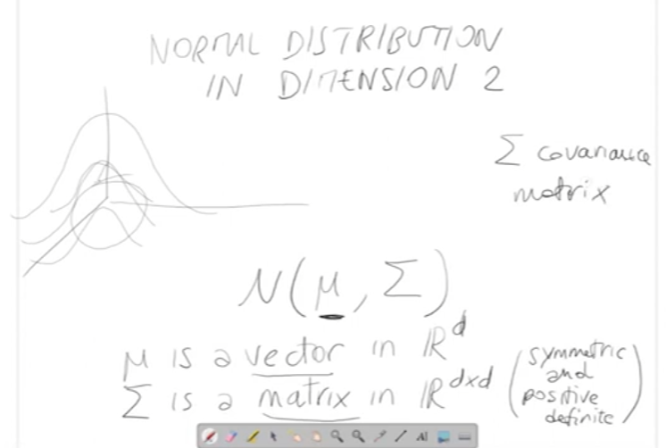
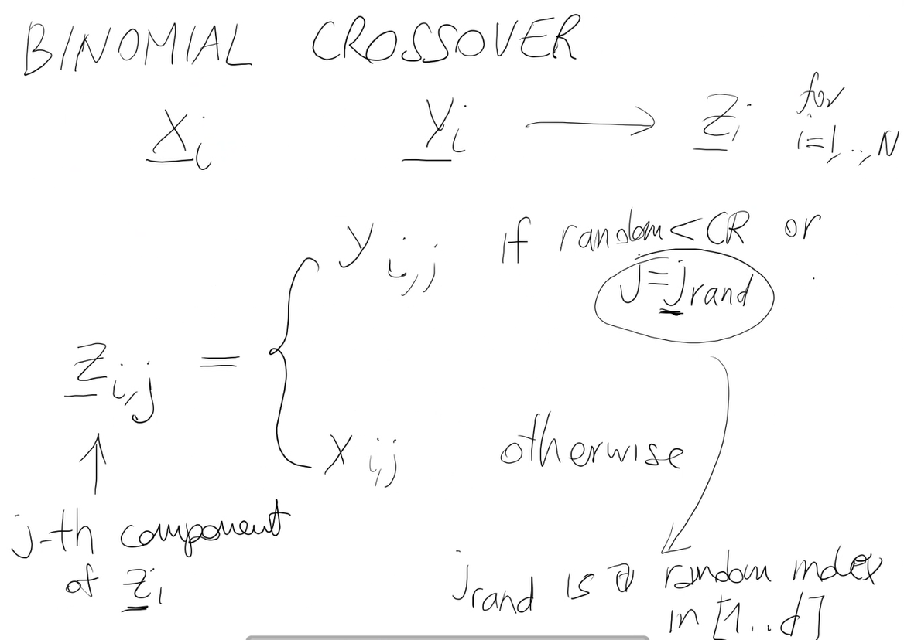

# **Computational Intelligence**

## **Indice**
- [Informazioni sul corso](#informazioni-sul-corso)
- [Introduzione](#introduzione)
- [Problemi di ottimizzazione](#problemi-di-ottimizzazione)
    - [Categorie dei problemi di ottimizzazione](#categorie-dei-problemi-di-ottimizzazione)
- [Local search](#local-search)
    - [Number Partitioning Problem NPP](#number-partitioning-problem-npp)
        - [Fenotipo e Genotipo](#fenotipo-e-genotipo)
    - [Minimo Ottimo Locale](#minimo-ottimo-locale)
    - [Local Search Algorithm](#local-search-algorithm)
    - [Attrazione del bacino su un minimo locale](#attrazione-del-bacino-su-un-minimo-locale)
    - [Iterated Local Search](#iterated-local-search-ils)
    - [Implementazione degli algoritmi Local Search](#implementazione-degli-algoritmi-local-search)
        - [Best improvement Local Search](#best-improvement-local-search)
        - [First improvement Local Search](#first-improvement-local-search)
        - [Iterated Local Search](#iterated-local-search)
- [Simulated annealing](#simulated-annealing)
    - [Principali caratteristiche](#principali-caratteristiche-di-sa)
    - [Implementazione algoritmo Simulated Annealing](#implementazione-algoritmo-simulated-annealing)
- [Applicazioni di algoritmi al problema del commesso viaggiatore (TSP)](#applicazioni-di-algoritmi-al-problema-del-commesso-viaggiatore-tsp)
- [Algoritmi Genetici](#algoritmi-genetici)
    - [Introduzione e Caratteristiche](#caratteristiche)
    - [Pseudocodice di GA](#pseudocodice-di-ga)
    - [Mating Pool](#mating-pool)
        - [Roulette Wheel](#roulette-wheel-ruota-della-fortuna)
        - [Tornei](#selezione-baata-su-tornei)
    - [Crossover](#1-crossover)
    - [Mutazione](#2-mutazione)
    - [Selezionare la nuova popolazione](#selezionare-la-nuova-popolazione)
    - [Criteri di Terminazione](#criteri-di-terminazione)
    - [Implementazione di un GA](#implementazione-di-un-ga)
    - [Implementazione GA per il problema MAX-CUT](#implementazione-di-un-algoritmo-genetico-per-il-problema-max-cut)
    - [Implementazione GA per il problema TSP](#implementazione-di-un-algoritmo-genetico-per-il-problema-tsp)
    - [Influenza dei parametri negli algoritmi](#parametri-su-cui-si-può-agire-in-un-ga-e-la-loro-influenza)
- [Problemi Vincolati](#problemi-vincolati)
    - [Algoritmi genetici per problemi vincolati](#algoritmi-genetici-per-problemi-vincolati)
    - [Penalizzazione e Riparazione](#riparazione-e-penalizzazione)
        - [Confronto](#confronto-tra-i-due-metodi-penalizzazione-e-riparazione)
- [Algoritmi evolutivi per l'ottimizzazione continua](#algoritmi-evolutivi-per-lottimizzazione-continua)
    - [Strategie evolutive](#strategie-evolutive)
        - [(1+1)-ES](#11-es)
        - [(λ, μ)-ES](#λ-μ-es)
        - [(λ + μ)-ES](#λ--μ-es)
        - [CMA-ES](#cma-es)
        - [Differential Evolution (DE)](#differential-evolution-de)
            - [Mutazione Differenziale](#mutazuione-differenziale-rand1)
            - [Crossover Binomiale](#crosover-binomiale-bin)
            - [Aggiornamento della popolazione](#aggiornamento-della-popolazione)
            - [Implementazione dell'algoritmo di Differential Evolution](#implementazione-dellalgoritmo-di-differential-evolution)
            - [Altre varianti per il DE](#altre-varianti-del-differential-evolution)
            - [Ottimizzazione dei parametri](#ottimizzazione-dei-parametri)
            - [DE per problemi di ottimizzazione discreti](#de-per-problemi-di-ottimizzazione-discreti)
- [Programmazione Genetica](#programmazione-genetica)
    - [Caratteristiche principali](#caratteristiche-principali)
    - [Vanataggi e Svantaggi della Programmazione Genetica](#vantaggi-e-svanataggi-della-programmazione-genetica)
    - [Altre forme di programmazione genetica](#altre-forme-della-programmazione-genetica)
- [Swarm Intelligence](#swarm-intelligence)
    - [Particle Swarm Optimization (PSO)](#particle-swarm-optimization-pso)
        - [Descrizione](#descrizione-pso)
        - [Altri aspetti interessanti](#altri-aspetti-interessanti)
        - [Pseudocodice e Spiegazione](#pseudocodice-algoritmo)
    - [Ant Colony Optimization (ACO)](#ant-colony-optimization)
        - [Problema del TSP utilizzando ACO](#tsp-utilizzando-aco)
        - [Pseudocodice](#pseudocodice-dellalgoritmo-aco)
        - [I Parametri di ACO](#i-parametri-di-aco)
        - [Altre applicazioni di ACO](#applicazioni-di-aco)
- [Probelmi di Ottimizzazione Multi-Obiettivo](#problemi-di-ottimizzazione-multi-obiettivo)
    - [Dominanza di Pareto](#dominanza-di-pareto)
    - [NSGA-II](#nsga-ii)
        - [Non-Dominated Sort](#non-dominated-sort)
        - [Crowding Distance](#crowding-distance---calcolo-del-fattore-distanza)


### Informazioni sul corso
- **Esame** (2 parti):
    - **Progetto**
        - Implementazione di qualche algoritmo (linguaggio di programmazione a scelta):
            - algoritmi evolutivi
            - sistema fuzzy
            - sistema probabilistico
            - libreria per velocizzare alcune cose e quindi applicarlo ad un problema effettivo
        - Analisi di un articolo di ricerca (solo per studenti che hanno un interesse scientifico (tesi, dottorato ecc...))
    - **Orale**:
        - domande sul programma
        - presentazione progetto

- **Materiale**:
    - libri di testo (qualche capitolo indicato dal prof)

<hr>

# **Introduzione**

### **Che cos'è la computational intelligence?**
È una parte dell'Intelligenza Artificiale che comprende alcuni strumenti che si utilizzano in essa. Argomenti principali:
1. **Reti neurali** (*già trattato nel corso di Machine Learning e quindi non lo trattiamo*)
    - Sono lo strumento più famoso ma non l'unico che può essere utilizzato nelle applicazioni di intelligenza artificiale.
2. **Algoritmi evolutivi**
    - Ne fanno parte le **Metaeuristiche**.
    - Sono uno strumento utilizzato per risolvere i **problemi di ottimizzazione** particolarmente difficili. <br>
    Esempi di problemi di ottimizzazione:
        - Il training delle reti neurali;
        - Clustering;
        - Costruzione degli alberi decisionali ecc...
        - Uno dei problemi di ottimizzazione più famosi è il "*Problema del commesso viaggiatore*".
3. **Logica Fuzzy**
    - È uno strumento che serve per rappresentare **concetti vaghi**.
        - Esempio di concetto vago: *La temperatura è alta* (non ti dico esattamente una soglia secondo cui la temperatura inizia ad essere alta o meno). Esiste un confine sfumato tra *alto* e *non alto*.
4. **Modelli probabilistici**
    - Usati per rappresentare l'**incertezza**.
        - Esempio: La probabilità che il paziente abbia una determinata malattia è 0.25 , come posso usare questa informazione all'interno di un sistema di AI? I modelli probabilistici consentono di trattare questo tipo di informazioni (probabilistiche).

Gli ultimi 3 argomenti completano il bagaglio degli strumenti che possono essere utilizzati nell'AI. 

Esistono 2 livelli nelle Intelligenze Artificiali (e da questo anche 2 modi per approcciare l'AI):
- **Livello simbolico** (*Intelligenza Artificiale classica*)
    - Logica proposizionale/booleana (algoritmi di ricerca come: BFS, DFS, A*, planning ecc...)
        - **Opera ad alto livello**: l'informazione è codificata in modo simbolico (rappresentazione simbolica).
- **Livello subsimbolico** (*Intelligenza Artificiale "moderna"*)
    - Ad esempio il riconoscimento delle immagini funziona meglio a livello subsimbolico (lavoro sui pixel e non sulle forme geometriche individuabili nelle immagini, come viene invece fatto a livello simbolico).
    - Rappresentazione numrica invece della rapresentazione logica/discreta (esempio nel riconoscimento delle immagini sopra).

<hr>

# **Problemi di ottimizzazione**
Molti problemi di ottimizzazione sono computazionalmente difficili (Es: np-hard o peggio).<br>
*Breve cenno sul significato di **NP***: La classe di problemi ***NP*** comprende tutti quei problemi decisionali che, per trovare una soluzione su una macchina di Turing non deterministica, impiegano un tempo polinomiale. La classe NP prende il suo nome dall'abbreviazione di *Nondeterministic Polynomial Time*.

### **Problema del commesso viaggiatore *TSP***
- *n* città <br>


- Il grafo è solitamente completo (da ogni città posso andare ad ogni altra città) e può essere sia orientato che non orientato.
- Ho una matrice che rappresenta le distanze/costi:
    - d(i,j) è la distanza tra la città *i* e la città *j* (o il costo per andare da *i* a *j*)
    - Se il grafo è completo ogni entrata ha un numero reale
    - Se non c'è collegamento tra *i* e *j* si può mettere che d(i,j) = *infinito*

Il problema TSP può essere:
- **simmetrico**: d(i,j) = d(j,i) $\forall$ (per ogni) *i*,*j* 
- **asimmetrico**: d(i,j) != d(j,i) $\exists$ (esistono) *i* e *j* per cui si verifica ciò (Esempio: città in salita e discesa).
    - **euclideo**: d(i,j) = distanza(posizione città *i*, posizione città *j*) -> distanza euclidea (non realistica, realistica solo se la terra fosse piatta).

#### Il TSP è *NP*-hard se visto come problema di ottimizzazione, oppure è *NP*-completo come problema decisionale.

***Definizione***. Un problema di ottimizzazione è definito da:
- uno spazio di ricerca X
- una funzione obiettivo f: X -> R (non necessariamente sarà sempre R)

Lo scopo è trovare il valore x* appartenente a X tale che f(x*) sia minimo (o massimo)

Nel problema del commesso viaggiatore:
- X è l'insieme di tutti i cicli Hamiltoniani del grafo
    - un ciclo Hamiltoniano è una sequenza di città che inizia da una città prestabilita *c0*, passa per tutte le città una sola volta e termina in *c0*. <br>
    Es: 1->3->4->2->6->5->1 (nel grafo di prima)
- La funzione obiettivo f è la distanza totale (o il costo) del ciclo Hamiltoniano. <br>
    f(1->3->4->2->6->5->1) = d(1,3) + ... + d(5,1)
    <br>
    - x* è il ciclo Hamiltoniano con la minima distanza totale. <br>
    Ciò lo rende un problema *NP*-hard.

*Note*:
- Trovare un ciclo Hamiltoniano è semplice se il grafo è completo.
- Computare f è facile (Calcolare f).
- La difficoltà sta nel trovare x*

X è l'insieme di tutte le permutazioni delle città (dei nodi del grafo) (con la prima città che deve essere rimessa anche in fondo). 

In alcuni problemi anche generare un elemento di X può essere difficile (elemento di X = soluzione ammissibile).

## **Categorie dei problemi di ottimizzazione**:
- **Discreti** (Es: TSP)
    - Un problema di ottimizzazione è discreto quando X è un insieme finito.
    - In un problema discreto ogni X(*i*) ha un dominio finito.
        - *Es:* Se il grafo ha n città, ci sono (n-1)! cicli hamiltoniani.
- **Continui**
    - X è un insieme infinito (Es: R o un intervallo)
        - Lo spazio di ricerca è costituito da numeri reali, vettori di numeri reali, matrici di numeri reali ecc...
        - *Es*: determinare la posizione di *n* punti in modo tale da minimizzare la somma complessiva delle distanze da un determinato punto fissato. 
    - In un problema continuo ogni X(*i*) ha un dominio infinito.
        - *ES*: ho una città e devo mettere delle stazioni di ricarica. Le devo mettere in modo tale che sia minima la somma complessiva delle distanze delle varie città in modo tale che un veicolo non deve fare troppa strata per potersi ricaricare.

Si distingue anche tra problemi di ottimizzazione con:
- **funzioni obiettivo lineari**
    - f(x*i*, ... , x*n*) = w*1*x*1*+....+w*n*x*n*
    - *Es*: funzione problema dello zaino.
- **funzioni obiettivo non lineari**
    - f non è una combinazione lineare x*1*, ... , x*n*

Si hanno inoltre:
- **problemi vincolati**:
    - X è ottenuto aggiungendo vincoli allo spazio di ricerca originale.
        - Es: lo zaino è un problema vincolato. Senza vincoli lo zaino è senza limiti e si prenderbbero tutti gli oggetti, ottenendo il massimo valore. Il problema dello zaino classico è quello vincolato (ogni oggetto ha un valore e un peso e lo zaino ha un limite)
    - X è quindi ristretto.

I problemi di ottimizzazione possono anche avere:
- **una singola funzione obiettivo**
- **più funzioni obiettivo**
    - *Es*: TSP con tempo e carburante come funzioni obiettivo (che in questo caso sono addirittura in competizione).

### Quali sono le possibili soluzioni algoritmiche per un problema di ottimizzazione combinatoria come TSP?
1. **Algoritmi esatti**: 
    - Risolvono in maniera esatta il problema. Non sono comunque in grado di risolvere istanze medio-grandi.
    - All'aumentare dell'istanza anche di poco, i tempi di calcolo crescono esponenzialmente. Perche gli algoritmi sono solitamente esponenziali, al massimo polinomiali.
    - È possibile anche usare alcuni "*universal solver*". Ad esempio un SAT solver o MIP solver. Significa formulare il problema di ottimizzazione come un SAT o un *mixed integer probgramming*.
2. **Algoritmi Approssimati**: 
    - Sono algoritmi studiati ad Hoc per il problema che trovano soluzioni sub-ottimali in tempo polinomiale. La soluzione trovata non è peggio di una certa quantità rispetto all’ottimo. Usano delle euristiche pensate appositamente per il problema.
    - **Approssimare il problema di ottimizzazione**: utilizzare un algoritmo approssimato.
        - Anziche trovare x* tale che f(x*) sia massimo o minimo, questi algoritmi trovano un x' tale che f(x') <= *k* * f(x*)
            - *Es*: f(x*) = 300 <br>
            x' ---> f(x') <= 2*300 <br>
        Ovviamente minore è *k* e meglio è.
        - x' non è un minimo, è qualcosa che gli si avvicina ma quanto è lontano?
        - Per ottenere bassi valori di *k* è richiesto maggiore tempo.
        - Ci sono dei problemi di ottimizzazione in cui *k* non può essere scelto però. Non possono essere approssimati meglio di quel *k*.
3. **Metaeuristiche**:
    - Trovano soluzioni sub-ottimali in tempo polinomiale. Non danno la garanzia di un limite per la soluzione, ma il vantaggio è che lo schema si può applicare con opportuni cambiamenti a molti problemi di natura diversa. Questi metodi fanno poche o nessuna ipotesi sul problema da ottimizzare e possono cercare spazi molto ampi di soluzioni candidate.
    - Una **metaeuristica** è un algoritmo che da una soluzione del problema, la quale non è necessariamente ottima ma potrebbe essere molto buona, ottenuta soprattuto in un tempo ragionevole. Non c'è nessuna garanzia su quanto è buona la soluzione e non riesco a stimarlo. Questo è il prezzo da pagare per utilizzare una metaeuristica.
    - Metaeuristica significa che la stessa `tecnica` può essere usata (adattandola) a un'ampia gamma di problemi di ottimizzazione.
        - *Es*: algoritmi genetici (risolvono problemi come lo zaino, il TSP, problemi di scheduling, problemi di ottimizzazione discreti, continui ecc...).
    - `Tecnica`: È uno schema per un possibile algoritmo (ci sono dei buchi da riempire che dipendono dal problema e altri possono essere scelti dal programmatore).
    - Molte metaeuristiche usano i numeri casuali (pseudo casuali). Significa che sono algoritmi randomizzati. 
        - Più esecuzioni possono tornare soluzioni diverse:
            - si prende la migliore oppure la media delle soluzioni

<hr>

## **Local search**
- Si utilizza in problemi di ottimizzazione discreta.

Le soluzioni nello spazio di ricerca sono connesse e formano un grafo orientato. <br>
 <br>
- *S* e *S'* sono soluzioni
- Si dice che *S'* è un vicino di *S*
- *S''* è un vicino di *S'*
- *S'''* non è vicino di *S*

*S'* è un **vicino** di *S* se:
1. C'è un arco che va da *S* a *S'*
2. *S'* può essere ottenuto da *S* usando una **trasformazione elementare**

*Primo esempio*:
### **Number partitioning problem (NPP)**:
#### *Rappresentazione con sottoinsiemi*
- dati *n* numeri interi x*1*, ... , x*n* <br>
Dividere i numeri in due sottoinsiemi disgiunti S*1* e S*2* <br>

S1 e S2 devono soddisfare la seguente condizione: <br>
 <br>
è **minima**.

*Per esempio*: <br>
x*i* = {14, 20, 13, 8, 21, 10, 9, 4} <br>
S*1* = {14, 20, 8 , 10} -> somma = 52 <br>
S*2* = {21, 13, 9, 4} -> somma = 47 <br>
F(s1, S2) = |52-47| = 5 <br>

S*1* = {14, 20, 4 , 10} -> somma = 48 <br>
S*2* = {21, 13, 9, 8} -> somma = 51 <br>
F(s1, S2) = |48-51| = 3 *questa soluzione è migliore di quella precedente* <br>

**Una soluzione di NPP è una coppia di sottoinsiemi S1 e S2.**

#### *Rappresentazione con vettore di n-bit*
Ma una differente rappresentazione può essere basata su un **vettore di n-bit b**.

{14, 20, 8, 10} {13, 21, 9, 4} -> [00101011] <br>
b*i* = 0 -> x1 ∈  S*1* <br>
b*i* = 1 -> xi ∈  S*2*

### **Fenotipo e Genotipo**
- La rappresentazione binaria è chiamata **genotipo** ed è una rappresentazione interna (può essere ad esempio utilizzata da un algoritmo in modo efficace)
- La rappresentazione sui sottoinsieme è chiamata **fenotipo** ed è una rappresentazione esterna.

La differenza sta che l'utente è interessato al fenotipo e invece l'algoritmo può utilizzare il genotipo perchè potrebbe funzionare meglio.

Il passaggio(mapping) da genotipo a fenotipo e viceversa deve essere computazionalmente veloce e facile, ma potrebbe non essere necessariamente 1:1 (ad un genotipo corrisponde ad un fenotipo, l'importante è che ogni genotipo abbia un fenotipo diverso. Potrebbero esserci due genotipi che corrispondono ad un fenotipo).

Un algoritmo può decidere di usare una rappresentazione ridondante dove differenti genotipi corrispondono allo stesso fenotipo.

*Ritornando all'esempio di prima*: <br>
Fenotipo S1, S2 <br>
Genotipo b

Tra i vettori di n-bit c'è l'operazione elementare chiamata **bit-flip**.

Dato un vettore n-bit e un indici i<= k <= n, negare il k-esimo bit <br>
b = [0010**1**100] <br>
k = 5 <br>
b -> [0010**0**100] <br>

[00101100] si può trasformare in tanti modi applicando il bit-flip a tutti i possibili bit. *Esempi*:

1. [10101100]
2. [01101100]
3. [00001100]

I possibili vicini di questa soluzione sono 8 e ognuno si ottiene facendo il flip di un bit. <br>
Lo spazio di ricerca del NPP con la rappresentazione binaria è composto da 2^n vettori di n-bit , ciascuno dei quali è collegato a n vicini ottenuti tramite un bit-flip.

Questo spazio di ricerca si chiama **ipercubo**:
- per n=2 è un quadrato
- per n=3 è un cubo
- n = 4 non è facilmente disegnabile
- ecc...

**La funzione obiettivo  f(S*1*,S*2*) può essere riscritta come f(b)** <br>


Partendo da una soluzione **b**, alcuni vicini (*b*') potrebbero essere migliori e altri (*b*'') potrebbero essere peggiori. Altri vicini possono essere buoni quanto b. Il paragone dei vicini si fa con le funzioni obiettivo. <br>


<hr>
 
### **Minimo ottimo locale**
*In NPP è il minimo locale*.

- **L'ottimo locale** è una soluzione x | nessun vicino è meglio di x, ∀ y | y è vicino di x , f(y) >= f(x).
- x è un **minimo locale stretto** se ∀ y | y è vicino di x, f(y) < f(x).

*NOTAZIONE*: **N(x) = {vicini di x}**

Minimo:
- **locale** -> confronto con i vicini.
- **globale** -> confronto il punto con tutti
    - Un **minimo globale** per una funzione f è una soluzione x | f(x) <= f(y) ∀ y ∈ X
    - Un **minimo globale stretto** f(x) < f(y) ∀ y ∈ X

`Il problema di ottimizzazione è risolto se trovo il minimo globale. Altrimenti ho trovato una soluzone sub-ottimale.`

Un semplice algoritmo che trova un minimo locale si chiama **Local Search**.

### **Local search algorithm**
```pseudocode
function_LS(f,X)
    x: scelto randomicamente (o con qualhe criterio) (soluzione)
    found = false
    do 
        y:= migliore dei vicini di x (prendo x trovo i vicini, calcolo f e prendo quella con valore più basso)
        if f(y) >= f(x) then 
            found:= True
        else 
            x:= y
    while not found
return x
```
*Come scegliere il miglior vicino?*
```pseudocode
    y:= primo elemento di N(X)
    fy:= f(y)
    for z in N(X)
        fz:= f(z)
        if fz < fy then
            y:= z
            fy:= fz
        end if
    end for
return y
```
- È facile provare che **LS** **restituisce sempre il minimo locale**. C'è qualche probabilità di ottenere il minimo globale anche se solitamente la soluzione restituita ottenuta non è il minimo globale.

### **Attrazione del bacino su un minimo locale**
L'attrazione del bacino su un minimo local x* è l'insieme delle soluzioni x tali che se LS parte da x produce x*. <br>
 <br>

- L'algoritmo di ricerca locale appena visto è chiamato **best improvement local search**.

Un'altra possibilità è di scegliere (se c'è) un vicino di x che è migliore di x (non il migliore) -> **first improvement local search**

```pseudocode
Function_LS_fi(X,f)
    x:= initial solution (Random)
    fx:= f(x)
    found = false
    do 
        y, fy := un vicino migliore di x (esplora N(X) con un ordine casuale)
        if y = Φ (vuoto) then
            found:= true
        else 
            x:= y
            fx:= fy
    while not found
return x
```

## **Iterated local search (ILS)**


*Elementi dell'algoritmo*:
- LS con scelta iniziale della soluzione
- **nt** = numero di tentativi del secondo tipo (tentativi infruttuosi)

```pseudocode
Function_ILS(f,X, nt)
    x0:= sluzione iniziale
    x, fx := LS(f, X, x0)
    k = 0
    while k <= nt
        y:= perturbation(x)
        z, fz := LS(f,X, y)
        if fz < fx then
            x:= z
            fx:= fz
            k:= 0
        else
            k:= k+1
        end if
    end while
return x
```

- La **perturbazione** è una piccola modifica.
    - Deve essere piccola perchè se lo stravolgo mi sposto troppo ed è come se ricominciassi da zero.
- **h** rappresenta la forza della perturbazione
    - *Per esempio in NPP h è il numero dei bit-flip applicati a x*.

`I concetti di local minimum e global minimum e gli algoritmi LS e ILS funzionano per ogni problema di ottimizzazione discreta data la struttura di vicinato.`

*Per esempio nel TSP i vicinati* <br>
 <br>
in rosso gli archi che non c'erano.

<hr>

## **Implementazione degli algoritmi Local Search**
Innanzitutto è necessario definire la classe `Problem` per definire la struttura di base del problema, la sua inizializzazione e le funzioni di comodo.
### **Best improvement Local Search**
```python
# number partition problem
import numpy as np

class Problem:
    def __init__(self, num):
        self.dim = num
        self.numbers = np.random.randint(1, 100000, num)    # Creazione istanza

    def objective_function(self, sol):
        # La soluzione è un vettore di 0 e di 1
        '''
        - 0 rappresenta che stanno nel primo sottoinsieme
        - 1 rappresenta che stanno nel secondo sottoinsieme
        '''
        s = 0
        for i in range(self.dim):
            if sol[i] == 0:
                s += self.numbers[i]
            else:
                s -= self.numbers[i]
            
        return abs(s)
    
    def objective_function(self, sol):  # Molto più efficiente
        s = sum((1-2*sol)*self.number)
        
        return np.abs(s)

    def get_dim(self):
        return self.dim
```
Si può ora procedere all'implementazione dell'algoritmo di ricerca `Local Search`
```python
import numpy as np
from NPP import *

# local search algorithm for a binary problem
# BEST IMPROVEMENT
def local_search(prob, init_sol=None):
    n = prob.get_dim()
    if init_sol is None:
        x = np.random.randint(0, 1+1, n)
    else:
        x = init_sol.copy()
    
    improved = True
    fx = prob.objective_function(x)
    print("Initial value {}".format(fx))
    while improved:
        best_f = 1e300  # Numero grande per i confronti seguenti
        for i in range(0, n):
            x[i] = 1-x[i] # Bit-flip -> questa logica può essere migliorata e resa più efficiente in quanto ci mette O(n^2) operazioni
            fy = prob.objective_function(x)
            if fy < best_f:
                y = x.copy()
                best_f = fy
            x[i] = 1-x[i] 
        if best_f < fx:
            fx = best_f
            x = y
            improved = True
            print("New value {}".format(fx))
        else:
            improved = False
    return x, fx 
```
- Il **bit-flip** può essere chiamato Δf(x, i) = f(x con i-esimo bit complementare) - f(x) <br>
Nel problema NPP è anche semplice trovare il miglior vicino di x, in O(n) anzichè O(n^2). <br>
A sua volta se riduco il tempo di ricerca della Local Search lo riduco anche delle versione iterata in quanto usa essa stessa.


Per testare l'algoritmo e vedere le varie info si consigliano i seguenti comandi (disponibili nel file ***test.py*** nella directory apposita).
```python
from local_search import *

np.random.seed(42) # Fisso il seed per la riproducibilità degli esperimenti

p = Problem(100) # Creo istanza problema di lunghezza 100

print(p.numbers) # Stampo i vari numeri che popolano il vettore popolato randomicamente
print(p.get_dim())

x, fx = local_search(p) # Eseguo la Local Search
print(x, fx)

x, fx = local_search(p,x) # Se la rieseguo partendo dalla soluzione di prima si vede che ritorna sempre lo stesso valore e quindi non migliora

risultati = [local_search(p) for run in range(100)] # Eseguo Local Search 100 volte
print(risultati)

# Analisi sui valori dei risultati ottenuti
ff = [coppia[1] for coppia in risultati]

min = np.min(ff)
# Altri tipi di analisi
'''
np.mean(ff)
np.max(ff)
np.min(ff)
np.median(ff)
'''
```
### **First Improvement Local Search**
Si passa ora all'implementazione della ***Local Search*** nella sua versione **First improvement**.
```python
import numpy as np
from NPP import *

# local search algorithm for a binary problem
# FIRST IMPROVEMENT
def local_search(prob, init_sol=None, verbose= False):
    n = prob.get_dim()
    if init_sol is None:
        x = np.random.randint(0, 1+1, n)
    else:
        x = init_sol.copy()
    
    improved = True
    fx = prob.objective_function(x)
    if verbose:
        print('Initial value {}'.format(fx))
    while improved:
        best_f = fx
        ordering = list(range(0,n))
        np.random.shuffle(ordering)
        for i in ordering:
            x[i] = 1-x[i]
            fy = prob.objective_function(x)
            if fy < best_f:
                y = x.copy()
                best_f = fy
                x[i] = 1-x[i]
                break
        
            x[i] = 1-x[i]
        if best_f < fx:
            fx = best_f
            x = y
            improved = True
            if verbose:
                print("New value {}".format(fx))
        else:
            improved = False
    return x, fx 
```
Questa versione è molto più veloce di quella precedente.
### **Iterated Local Search**
```python
from local_search_fi import *
from NPP import *

def iterated_local_search(prob, num_tries, num_flips, init_sol= None):
    n = prob.get_dim()
    if init_sol is None:
        x = np.random.randint(0, 1+1, n)
    else:
        x = init_sol.copy()
    nt = 0
    fx = prob.objective_function(x)
    while nt < num_tries:
        y =perturbation(x, num_flips)
        z, fz = local_search(prob, y)
        if fz < fx:
            x = z
            fx = fz
            nt = 0
        else:
            nt+=1
    return x, fx

def perturbation(x, num_flips):
    n = len(x)
    y = x.copy()
    for flip in range(num_flips):
        i = np.random.randint(0, n)
        y[i] = 1 - y[i]
    
    return y
```
Quest'ultima può essere in realtà implementata utilizzando entrambe le tipologie di `Local Search` (best improvemente e first improvement), con la quale si noteranno differenti prestazioni in termini di tempo e probabilmente anche della soluzione trovata.

Per quanto riguarda il codice sorgente completo, eventuali comandi di test e altro vedere i relativi file nell'apposita directory per la ***Local Search***.

<hr>

## **Simulated annealing**
- Nella *ricerca locale* (anche nella sua versione *iterata*), si passa da un elemento ***x*** a un elemento **migliore**.
    - **Nella ricerca locale** il passaggio avviene in maniera *diretta* perchè si prende un vicino di x e lo si cerca di migliorare passando per uno dei vicini di quest'ultimo. 
    - Nella ricerca locale devo quindi migliorare ad ogni passaggio. **Quando non è più possibile, l'algoritmo termina**.
- **Nella ricerca locale iterata**, il procedimento è diverso, ma ad ogni passaggio si deve comunque migliorare. <br>
Si parte da un punto ***x0***, si applica la ricerca locale e si arriva in ***x1*** (minimo locale). Si applica una perturbazione a quest'ultimo (che potrebbe anche peggiorare la situazione ma non importa) e si riapplica la ricerca locale arrivando in ***z***. Se z è migliore la ricerca procede da questo punto, se invece ho peggiorato non si accetta (perchè si deve comunque sempre migliorare). <br>
Dopo un tot di tentavi infruttuosi la ricerca termina (oppure si possono scegliere altre condizioni di terminazione. Es. quante volte ho valutato f).

Nel **Simulated annealing** invece, si può anche peggiorare (ma di poco) e soprattutto all'inizio. <br>
Si intende che **le soluzioni** possono anche peggiorare.

```pseudocode
x:= initial solution                        # può essere preso random
fx:= f(x)
t:= initial temperature
for i:= 1 to num_iterations
    y:= selecet a random neighbor of x
    fy:= f(y)
    df=fy-fx                                # differenza in f
    p:= exp(-df/t)                          # se df è negativo, p è maggiore di 1
    if random(0,1) < p then                 # Se fy<fx, y è accettato come nuovo valore di x
        x:= y
        fx:= fy
    end if
    t:= t * delta_t                         # delta_t = 0.95
end for

return x, fx
```
***Cosa accade?*** <br>
Quando f(y) >= f(X), y è accettato con una probabilità ***exp(-df/t)***. <br>
Più è basso df e maggiore è la probabilità di accettazione. Se la differenza fosse 0 o negativa, lo accetterebbe sempre. <br>
Maggiore è t, maggiore è la probabilità di accettazione. <br>
- I peggioramenti non gravi sono quindi accettati meglio dei peggioramenti gravi.
- I peggioramenti sono accettati soprattutto quando la temperatura è alta.

È altresì importante che la temperatura diminuisce mano a mano.

All'inizio quindi la tendenza ad accettare peggioramenti è alta e poi scende. Verso la fine il **simulated annealing (SA)** accetta solo miglioramenti (perchè la probabilità di accettazione è così bassa che è come se fosse 0).

**Questo algoritmo è molto più casuale** (randomico) della ricerca locale e della ricerca locale iterata (vedere quanti eventi random ci sono nello pseudocodice).

### **Principali caratteristiche di SA:**
1. È molto più randomico di LS e ILS
2. C'è un bilanciamento tra **exploration** e **exploitation**. <br>
**Exploration**: guardare intorno a x (esplorare lo spazio di ricerca), senza prendere troppo in considerazione la funzione obiettivo f. <br>
**Exploitation**: cerca necessariamente il vicino migliore. <br>
All'inizio prevale l'exploration e mano a mano che la temperatura scende, la componente di exploitation prevale.
3. SA può essere usato anche per l'ottimizzazione continua, facendo una piccola modifica (Vedi sotto). <br>
**Ottimizzazione continua**: x non è un vettore o una permutazione di numeri (0 e 1), ma è fatto di numeri reali (il concetto di vicini non ha senso nei numeri reali). <br>
```pseudocode 
y:= x+delta_x 
```
dove delta_x è un vettore di numeri casuali piccoli nell'intervallo *[-epsilon, +epsilon]*. <br> Ciò indica "muoviti da x di un passettino".

**Uno dei problemi principali di SA è come gestire la temperatura**:
- trovare il valore iniziale per t_init
- trovare come aggiornare t

<hr>

## **Implementazione algoritmo Simulated Annealing**
L'implementazione seguente tratta l'algorimto **SA** sul problema **NPP**, quindi è necessario fare riferimento al file ***NPP.py***.
```python
import numpy as np
from NPP import *

# simulated annealing per il problema binario
def simulated_annealing(prob, num_iter, init_sol=None):
    n = prob.get_dim()
    if init_sol is None:
        x = np.random.randint(0, 1+1, n)
    else:
        x = init_sol.copy()
    fx = prob.objective_function(x)
    temp = 0.1 * fx / (-np.log(0.5))
    for i in range(num_iter):
        j = np.random.randint(0, n)
        y = x.copy()
        y[j] = 1 - y[j]
        fy = prob.objective_function(y)
        df = fy - fx
        pr = np.exp(-df / temp)
        if np.random.random() < pr:     # if fy < fx or np.random.random() < pr
            x = y
            fx = fy
        temp = temp*0.95
    
    return x, fx
```
Il codice per fare eventuali test è il seguente:
```python
from NPP import *
from simulated_annealing import *

np.random.seed(1918)

instance = Problem(100)
x, fx = simulated_annealing(instance, 10000)
print(x, fx)
```
Nel caso in cui si abbia overflow nel decadimento di temp cambiare il tasso di decadimento (qui è 0.95).

<hr>

## **Applicazioni di algoritmi al problema del commesso viaggiatore (TSP)**
**TSP** = *problema del commesso viaggiatore*. <br>
In questo problema, una soluzione è una lista di vertici tale che:
1. inizia e finisce con lo stesso vertice
2. non ha vertici duplicati (tranne il primo e l'ultimo)
3. ha lunghezza **n+1**

Nel TSP ci sono vari concetti si vicini (possibili implementazioni):
- **SWAPE/EXCHANGE** <br>
*x* = `[0 2 3 5 4 1 0]` ---> *x'* (**vicino**) = `[0 2 1 5 4 3 0]` <br> 
Ci sono **O(n^2)** vicini.
- **2-OPT** <br>
**Tecnica 2-OPT** : prendo due archi che non devono essere vicini e li inverto. <br>
*x* = `[0 2 3 5 4 1 0]` ---> *x'* (**vicino**) = `[0 2 4 5 3 1 0]` <br>
Ci sono sempre O(n^2) vicini <br>
**2-OPT ha un'interessante proprietà:**
    - ***f(x'') = f(x) - d(2,3) - d(4,1) + d(2,4) + d(3,1)***
    -  <br>
    - *Nel TSP simmetrico, f(x'') può essere calcolato da f(x) in O(1)* -> **MOLTO INTERESSANTE** (di solito costa O(n))

File per il TSP
```python
import numpy as np

class Problem_tsp:
    def __init__(self, nc, mat):
        self.ncities = nc
        self.dmat = mat # Matrice che contiene le distanze

    def create_random_instance(nc):
        # Crea due vettori x e y che contengono le coordinate di ciascuna città nel range [-50,50]
        x = 100 * np.random.random(nc) - 50
        y = 100 * np.random.random(nc) - 50
        m = np.zeros((nc, nc))
        for i in range(nc):
            for j in range(nc):
                m[i,j] = np.sqrt((x[i]-x[j])**2+(y[i]-y[j])**2)
        return Problem_tsp(nc,m)
    
    # l è l'elenco dei nodi visitati, includendo il primo e l'ultimo (che sono uguali)
    def objective_function(self, l):
        s = 0
        for i in range(self.ncities):
            c1 = l[i]
            c2 = l[i+1]
            d = self.dmat[c1,c2]
            s = s+d
        return s
    
    def do_2_opt(l, i, j):
        l1 = l[:i+1]
        l2 = l[i+1:j]
        l3 = l[j:]
        return l1+l2[::-1]+l3
    
    # Compute the difference on the objective functuion if the 2-opt operation is performed
    def delta_2_opt(self, l, i, j):
        return -self.dmat[l[i], l[i+1]] - self.dmat[l[j-1], l[j]] + self.dmat[l[i], l[j-1]] + self.dmat[l[i+1], l[j]]
```
Il `delta` è in grado di calcolare quanto cambia la funzione obiettivo se io applico il `2-opt`, senza però farlo effettivamente e senza ricalcolare interamente la funzione obiettivo. <br>
Effettuare `2-opt` e ricalcolare la funzione obiettivo costa **O(n)**, invece così costa **O(1)**. <br>
A questo punto si può implementare una ricerca locale che usa `2-opt`.
```python
def local_search(self, init_sol=None, verbose=False):
        n = self.ncities
        if init_sol is None:
            # Creazione di una soluzione casuale
            x = list(range(1, n))
            np.random.shuffle(x)
            x = [0]+x+[0]
        else:
            x = init_sol.copy()
        improved = True
        fx = self.objective_function(x)
        if verbose:
            print("Initial value {}".format(fx))
        while improved:
            best_delta = 1e300  # Numero grande per i confronti seguenti
            # Il delta sarebbe quanto aumenta la funzione obiettivo se io faccio la 2-opt (l'obiettivo è averlo più basso possibile)
            for i in range(1, n-1): # Controllo cosa succede se applico 2-opt senza effettivamente modificare x (lo cambio solo dopo aver trovato la migliore configurazione possibile)
                for j in range(i+3, n):
                    delta = self.delta_2_opt(x, i, j)
                    if delta < best_delta:
                        i_best = i
                        j_best = j
                        best_delta = delta
            if best_delta < 0:
                fx = fx + best_delta
                x = Problem_tsp.do_2_opt(x, i_best, j_best)
                improved = True
                if verbose:
                    print("New value {}".format(fx))
            else:
                improved = False
        return x, fx 
```
Per provare l'implementazione, vedere il file ***test2.py***. Qui di seguito sono comunque riportati dei comandi di esempio.
```python
from TSP import * 
p = Problem_tsp.create_random_instance(50)
print(p.ncities)
print(p.dmat)

l = list(range(0, 50))
l.append(0)
print(len(l))

print(p.objective_function(l))

l1 = Problem_tsp.do_2_opt(l, 22, 44)
print(p.objective_function(l1))

delta = p.delta_2_opt(l, 22, 44)
print(delta)
print(p.objective_function(l)+delta)

p = Problem_tsp.create_random_instance(20)
print(p.local_search(verbose=True))
```
- applicare ILS
- applicare SA

Per quanto riguarda le istanze del TSP, è possibile:
- generarle a caso
- leggerle da file
    - Sono disponibili delle repo contenenti varie istanze <br>
    Vedi:
        - https://github.com/mastqe/tsplib.git
        - http://comopt.ifi.uni-heidelberg.de/software/TSPLIB95/

<hr>

# **Algoritmi genetici**
### **Caratteristiche**
È l'algoritmo più famoso in letteratura. <br>
L'algoritmo genetico si applica per risolvere un problema di ottimizzazione. <br>
È la più famosa metaeuristica.

È basata su una metafora semplice da capire
- **L'algoritmo usa una popolazione di individui**
- **Ciascun individuo è una soluzione del problema ed è rappresentato in genere come una stringa** (binaria)

Questa popolazione è modificata attraverso 3 operazioni
1. **Crossover**
2. **Mutazione**
3. **Rimpiazzamento**

C'è anche un'operazione antecedente al crossover: <br>
**0.** **selezione**: non modifica la popolazione, serve come punto di partenza per il crossover

La rappresentazione degli individui è detta **cromosomi**. 
- Ogni individuo è rappresentato come un cromosoma. Il cromosoma è il patrimonio genetico di un individuo.

Altre caratteristiche:
- Gli **GA** (genetich algorithm) sono molto studiati in molti articoli scientifici. Sia dal punto di vista teorico che dal punto di vista applicativo.
- GA **possono essere applicati a moltissimi problemi di ottimizzazione, sia discreti che continui.**
    - GAs hanno una **predisposizione per il discreto**. Sono naturalmente applicati a problemi discreti perchè gli individui sono stringhe.
- *GA sono stati introdotti da Holland nel 1970 e da allora sono la metaeuristica più famosa in assoluto* (da allora sono studiati e applicati in tantissime situazioni in cui gli algoritmi tradizionali non riescono a funzionare).

### **Rappresentazione cromosomi** 
#### **Applicazione di un algoritmo genetico ad un problema binario:**
s = [0,1,0,1,0,0,1,1]
- 8 **alleli**, ciascuno dei quali contiene un 0 o 1 (che sono chiamati **geni**)
    - gli **alleli** sono le **posizioni**
    - i **geni** sono che cosa **contiene**

<hr>

Ripassando, nei GA si ha:
- ***f*** funzione obiettivo
- ***X*** spazio di ricerca
- Popolazione di ***N*** individui, chiamati **cromosomi**. 
    - *Ciascun cromosoma codifica una soluzione, cioè un elemento di X*

Se il cromosoma *c* è direttamente la soluzione, f può essere applicata al cromosoma *c*. <br>
Altrimenti *f* deve essere riscritta (ridefinita) in modo da poter essere applicata a *c*, oppure *c* deve essere decodificato in modo da ottenere la soluzione corrispondente.

***Esempio***:
### **Applicazione degli algoritmi genetici al TSP***
Sono possibili molte rappresentazioni dello spazio di ricerca X:
1. Un cromosoma è la lista dei vertici visitati <br>
    `[0, 2, 3, 1, 5, 4, 0]`
2. Un cromosoma è la lista degli archi visitatu <br>
   `[(0,2), (2,3), (3,1), (1,5), (5,4), (4,0)]`
3. Un cromosoma è una matrice binaria di dimensione ***n x m*** tale che l'elemento M[i,j] = 1 se e solo se l'arco (i-->j) è visitato. <br>
*Questa rappresentazione funziona correttamente solo se il TSP è simmetrico.*
4. *Potrebbero esistere anche altre rappresentazioni*

**La funzione obiettivo f** va quindi riscritta per ognuna di queste rappresentazioni, oppure decido una volta per tutte quale deve essere la rappresentazione esterna, scrivo la funzione per quest'ultima e ogni volta che l'algoritmo genetico deve valutare f trasformo il cromosoma in soluzione. <br>
Quindi, ci sono 2 approcci per valutare la funzione obiettivo:
1. **Scrivo il codice per valutare f secondo la rappresentazione.**
2. **Scrivo un codice per valutare f usando uno standard per la soluzione** (per esempio una lista di vertici visitati). <br> 
Ogni volta che la funzione deve essere valutata da GA, si traduce il cromosoma nella forma standard applicando una funzione di decodifica per ottenere la soluzione.

Quindi, GA può decidere, per qualsiasi motivo, una rappresentazione interna (**GENOTIPO**) diversa da quella su cui l'utente ragiona (rappresentazione standard) (**FENOTIPO**).

<hr>

## **Pseudocodice di GA**
```pseudocode
function GA(X, f,                       //parametri del problemma
    N, Ngen, pCross, pMut)              //parametri dell'algoritmo

    inizializzo la popolazione
    for g:=1 to Ngen
        select the mating pool
        apply the crossover operation
        apply the mutation operator
        update the population
    end for
    
    return il miglior individuo trovato x* e il corrispondente f value f(x*)
```
*Cosa significa il miglior individuo trovato?*
- Molte metauristiche basati su metauristiche possono produrre, in qualsiasi passaggio, individui che sono peggiori o migliori di quelli prodotti nei passaggi precedenti.
    - Quindi ha senso memorizzare il miglior individuo trovato fino a quel punto (stato corrente).
    - C'è quindi una variabile nell'algoritmo che mi permette di controllare se il nuovo individuo è migliore di quello momentaneamente memorizzato.
        - Li confronto e in caso positivo salvo quello nuovo.

Ciò è molto utile se:
- L'algoritmo non sempre accetta miglioramenti
- L'algoritmo usa qualche meccaniscmo di restart (non riesco a migliorare allora provo a ripartire)

***NOTA***: Miglior individuo trovato -> variabile che conserva il miglior individuo di sempre.

La popolazione può essere inizializzata in 3 modi principali:
1. **Completamente a caso**
    - Se il problema **non ha vincoli**, tutte le soluzioni sono valide.
    - Se il problema **ha vincoli** (ad esempio il problema dello zaino), significa che non tutti gli individui rappresetano una soluzione valida
2. **Creare solo cromosomi validi**
3. **Creare 'buoni' individui** (non così scarsi). Per esempio utilizzando un'euristica ***h*** che mi permette di farlo.
    - **se h è deterministica**, può produrre un solo individuo. Di conseguenza gli altri N-1 vanno scelti a caso.
    - **in generale**, usare h solo per generare soltanto alcuni individui e gli altri generati in modo casuale.

#### **Differenza tra euristica e metaeuristica:**
- euristica è dipendente dal problema
- la metaeuristica no

## **Mating Pool**
Tornando alla spiegazione dello pseudocodice dell'algoritmo: <br>
***Primo passaggio:***
- *select of the mating pool M*

***Definizione***. <br>
Il mating pool M è un insieme di N/2 coppie di individui presi dalla popolazione (per esempio la popolazione attuale).
- M è usato per il passaggio successivo (Crossover)
- L'idea principale è di scegliere i migliori individui

*Come scegliere gli individui migliori?*
- **Roulette wheel**
- **Tornei**

### **Roulette wheel (ruota della fortuna)**


- Selezionare un individuo in modo casuale secondo la probabilità (in modo proporzionale) alla **fitness F** per ogni individuo.
    - *Un GA ha l'obiettivo implicito di massimizzare il valore di fitness degli elementi della popolazione degli individui.*
        - Posso accontentarmi anche di un singolo individuo con un alto valore di fitness F

**Caratteristiche:**
- Se il problema è di ottimizzazione è un problema di **massimizzazione**:
    - F può coincidere con la funzione obiettivo f.
    - Oppure **F è una trasformazione crescente di f**.
        - Es. F(x) = f(x)^2 <br>
- Se il problema di ottimizzazione è un problema di **minimizzazione**: 
    - **F deve essere una trasformazione decrescente**.
        - Es. F(x) = 1/f(x) <br>
        F(x) = 1000 - f(x) <br>
        F(x) = -log f(x) <br>
    - In questo caso se `f(x1) < f(x2)` (x1 è migliore di x1), allora `F(x1) > F(x2)` (x1 ha un valore di fitness maggiore di x2)
    - *Il TSP è un problema di minimizzazione*

Supponiamo che le fitness F(x) > 0 (siano tutte positive) per ogni x. <br>
La probabilità di pescare l'individuo x[i] è data da: <br>
```
F(x[i]) / F(x[1]) + F(x[2]) + ... + F(x[N])
```
***Per esempio***: <br> 
F(x1) = 10, F(x2) = 5, F(x3) = 15, F(x4) = 20, F(x5) = 10 <br>
p(x1) = 10 / (10 + 5 +15 +20 +10)    ----> 10/60 <br>
p(x2) = 5/60 <br>
ecc....

- Per pescare un individuo, si genera un numero reale casuale r tra 0 e 60.
    - Se r < 10 ---> estrai x1
    - Se r è tra [10, 15[ ---> estrai x2
    - se r è tra [15, 30[ ---> estrai x3
    - se r è tra [30, 50[ ---> estrai x4
    - se r è tra [50, 60[ ---> estrai x5

In questo modo genero ogni numero x[i] con una **probabilità proporzionale** a F(x[i]). <br>
**Il costo computazionale della singola estrazione è O(N)**.

- F può essere considerata anche come **rank** di x nella popolazione.
    - F=N per il *miglior individuo*
    - F=N-1 per il secondo miglior individuo
    - ...
    - F = 1 per il *peggior individuo*


### **Selezione baata su tornei**
- **scelgo k individui a caso e scelgo il migliore tra di loro** (a mo' di sfida)
- **è più veloce rispetto a fare la roulette wheel**
    - il costo di selezionare N/2 coppio è **O(kN)**, invece di **O(N^2)** per la roulette wheel

In questo modo il peggior individuo non verrà mai selezionato (non ha chance di essere selezionato perchè prendendo anche solo due individui. Il peggiore non sarà mai scelto a meno che tra le selezione degli individui io posso pescare più volte lo stesso individuo. In questo modo potrei prendere due peggiori e quindi viene selezionato). <br>
Questi metodi di selezione possono produrre un mating pool con individui identici

- I migliori individui possono essere rappresentati più volte.
    - Migliore è l'individuo e più coppie potrebbero esserci di lui.
    - I peggiori individui potrebbere anche essere assenti nel mating pool.
- Se un individuo è molto più buono degli altri:
    - con la roulette ci possono essere tante copie di lui a discapito degli altri
    - con i tornei non è detta ma potrebbe esserci comunque un numero abbastanza alto di copie

<hr>

## 1. **Crossover**
- L'operazione di crossover prende due cromosoimi **s1** e **s2**, genera 1 o 2 **nuovi  cromosomi**
- s1 e s2 sono chiamati **genitori**
- I due nuovi cromosomi **c1 e c2** sono chiamati **figli** 
- Si parte quindi da **N/2** coppie di individui
    - p1, p2
    - p3, p4
    - ...
    - p[N/2 -1], p[N/2]

Ciascuna di queste coppie è copiata e inviata allo step successivo (con probabilità **1-pCross**) oppure è modificata utilizzando l'operatore di crossover (con probabilità **pCross**).
- Ciascuna coppia p[i], p[i+1] produce 2 figli c[i], c[i+1]
    - c[i] = p[i] e c[i+1] = p[i+1] con probabilità **1-pCross**
    - c[i], c[i+1] = crossover(p[i] , p[i+1]) con probabilità **pCross**

***Operazioni di Crossover:*** <br>
Crea 2 figli (qualche volta un solo figlio ma deve essere applicato 2 volte, altre volte più figli e ne scelgo solo due) dai due genitori.
- ***one-point crossover***:
    - Utilizzato quando i due cromosomi sono stringhe o vettori di lunghezza fissa L
    - seleziona un **punto di taglio k casuale** tra 1<=k<L
    - *Per esempio:* <br>
    L'operazione chiamata <br>
    s1 = [0,1,0,1,0,0,1,1] <br>
    s2 = [1,1,0,1,0,1,0,0] <br>
    Si prende un **punto di taglio** e si crea un figlio con gli elementi a sinistra del taglio di uno e a destra del taglio dell'altro, e viceversa per l'altro figlio. <br>
     <br>
    In questo modo si può vedere che ***ciascun figlio eredita parte del patrimonio genetico dal primo genitore e parte dal secondo***. <br>
    `Si può dire che il crossover mescola i patrimoni genetici di due elementi di una popolazione, creando due elementi che sono nuovi.`
- È semplice gneralizzare il **one-point crossover al multi-point crossover**
    - ***2-point crossover***
        - **selezione 2 punti di taglio k e h** in modo casuale tale che k<h
        - *Per esempio:* <br>
        
- ***Crossover uniforme:***
    - i figli ereditano da un genitore o dall'altro in modo casuale
    - *Per esempio:* <br>
    
- *Ci sono anche molti altri tipi di crossover per altri tipi di cromosomi*
    - *Per esempio*: <br>
    **In TSP il one-point crossover non funziona bene**
        - da una coppia di cromosomi validi(genitori), può produrre 2 figli non validi
            - `p1 = 0 1 3 4 5 2 0`
            - `p2 = 0 2 1 5 3 4 0`
            - Se faccio il crossover ad un punto: <br>
             <br>
            c1 visita 3 due volte, ma non visita 2. <br>
            c2 fa il contrario. <br>
            Il problema sta in questo punto. Questo perchè in una soluzione del TSP ogni figlio deve visitare ogni nodo esattamente una volta.
            - Questo metodo di ricombinazioni non è adatto per il TSP (e anche per altri problemi basati sulle permutazini).
            - Neanche il Crossover uniforme funziona, ha ancora più chance di creare doppioni rispetto al one-point.
            - **Nel TSP si utilizzano altri sistemi per il crossover**

<hr>

## 2. **Mutazione**
***Definizione***. <br>
Mutazione significa alterare il cromosoma dei figli. <br>
I figli possono essere sia copie dei genitori o prodotti dal crossover (non è importante).
- Crea un nuovo individuo **mutando/alterando** un figlio appena prodotto dal crossover.
    - ***c -----> c'***
    - Lo si altera ad esempio **cambiando uno o più geni**.
- Queste operazioni si possono fare sulla rappresentazione e non sull'individuo (**differenza tra fenotipo e genotipo**)
- Il crossover usa il materiale genetico dalla popolazione
    - Il crossover ricombina tra loro cose che già esistono, non si hanno componenti nuovi per produrre individui. L'originialità è dovuta al fatto che li combino in modo diverso.
- **Invece la mutazione può produrre nuove componenti**

### **Operatore di Mutazione Standard**
Può essere usato quando i cromosomi sono vettori o stringhe. <br>
Altera ogni gene con una probabilità pMut *(probabilità di mutazione)*.

`c[i] = 0 1 0 1 0 0 1 1 1 0` *(stringa di bit binaria)* <br>
pMut = 0.1
- Significa che in media solo un gene (bit) su 10 viene alterato.
    - Con probabilità 1/10 lo altero
    - Con probabilità 9/10 lo lascio invariato.

`c'[i] = 0 1 0 1 0 1 1 1 1 0`

**NOTA**: ****pMut*** in generale si tiene bassa*

### **Selezionare la nuova popolazione**
Si hanno questi elementi tra cui scegliere:
- **N genitori**      (elementi della popolazione corrente) <br>
- **N figli**         (prodotti da crossover+mutazione)

1. **Valutare tutti gli N figli**
    - La nuova popolazione è composta dagli N figli (sostituzione dei genitori con i figli). Questo è ciò che accade a lungo andare in natura. Potrebbe tuttavia verificarsi che non tutti i figli siano adatti a vivere in questo ambiente.  
2. **Elitismo**: <br>
    La nuova popolazione è composta da 
    - K migliori individui tra i genitori e i figli
    - N-K figli <br>
    ***Esempio***: <br>
    K = 1   -> se il miglior individuo è un genitore, quest'ultimo viene selezionato e il peggior figlio non viene selezionato.
3. **Sopravvivono i migliori**: <br>
    È una condizione particolare del punto precedente. <br>
    Ovvero K = N. <br>
    La nuova popolazione è composta dai N migliori individui tra i genitori e i figli. <br>
    Non importa quindi l'età. È possibile che il miglior individuo rimanga sempre nella popolazione (immortale). Ciò è possibile anche nell'elitismo.
    
### **Breve recap sugli algoritmi genetici**: <br>
L'implementazione di un algoritmo genetico richiede molte scelte:
- **I parametri dell'algoritmo**:
    - `N` -> grandezza della popolazione
    - `num_gen` -> numero di generazioni (iterazioni dell'algoritmo genetico)
    - `pCross` -> probabilità del crossover (probabilità che una coppia selezionata durante il mating pool gli venga applicato il crossover)
    - `pMut` -> probabilità della mutazione
    - *Come si selezionano?* <br>
        Si fanno un pò di tentativi. Non ci sono regole generali che funzionano sempre. <br>
        **In generale**
        - pCross dovrebbe essere abbastanza alto (tra 0.8 e 1)
        - pMut dovrebbe essere bassa
        - N dovrebbe andare di pari passo alla dimensione del problema. Un problema più grande dovrebbe avere una popolazione più grande
        - Il numero di iterazioni (num_gen) dovrebbe essere sostituito da un altro criterio -> ***Criteri di terminazione***

### **Criteri di Terminazione**
- Dopo **num_gen** iterazioni/generazioni (criterio di iterazioni)
- Dopo **num_sec** secondi (criterio temporale)
    - ***Svantaggio***: dipende dalla velocità di esecuzione del programma. Il criterio ha senso se voglio una risposta velocemente. Il criterio non ha senso se voglio testare algoritmi testati su macchine diverse, è dipendente dalla macchina.
- Termino quando la funzione obiettivo ha raggiunto un livello prefissato

### Punti di scelta dell'algoritmo (oltre ai parametri):
- Criteri di terminazione
- Inizializzazione
- Selezione del mating pool
- Come fare il crossover
- Come fare la mutazione
- Come fare il rimpiazzamento (selezione della nuova popolazione)

***Crossover e mutazione dipendono fortemente dal problema. Dipendono dalla rappresentazione che si fa delle soluzioni.***

<hr>

## **Implementazione di un GA (recap)**
1. **Si deve implementare il problema** (la classe, i suoi metodi e funzioni)
    - Creare un'istanza a caso
    - Caricare un'istanza da file
    - Calcolare la funzione obiettivo (data una soluzione in qualche forma)
        - *Scegliere come rappresentare la soluzione* (già qui si deve scegliere che rappresentazione utilizzare)
2. **Implementare il Crossover e la Mutazione per la rappresentazione scelta dal programmatore**
3. **Il programamtore deve anche scegliere tutti i passaggi che devono essere fatti all'interno dell'algoritmo:**
    1. Inizializzazione
    2. Criterio di terminazione
    3. Selezione
    4. Rimpiazzamento (replacement)
    5. (Eventualmente) Altri passaggi (non solo in GA ma anche in altre metaeuristiche):
        - Metodi di ricerca locale per migliorare le soluzioni (*combinare la forza di un GA con un algoritmo di ricerca locale*: **Algoritmo Memetico**)
        - Un possibile modo per applicare la ricerca locale è quello di cercare di migliorare la miglior soluzione trovata dal GA. <br>
         <br>
        - Un altro possibile modo si applica nella situazione in cui talvolta la popolazione perde diversità (gli individui iniziano ad assomigliarsi molto l'un l'altro). La peggior situazione è che diventino tutti uguali. <br>
        Molti operatori di Crossover hanno la seguente proprietà: <br>
        *Se p1 = p2 allora il Crossover(p1, p2) produce figli uguali ai genitori*. <br>
        Quando un individuo è molto meglio degli altri (**super-individuo**), quest'ultimo tende a monopolizzare la popolazione (la porta ad essere simile a lui). Quando tutti gli individui sono uguali GA non funziona. L'unica operazione che potrebbe far uscire da questo stallo è la Mutazione. <br>
        **Prima cosa**: riconoscere quando la popolazione ha significativamente perso la sua diversità (ci sono varie tecniche per farlo). <br>
        **Seconda cosa**: Reagire (Ad esempio fermare l'algoritmo o reinizializzare la popolazione o una parte di essa, magari salvando la best solution ever found).
    6. Parametri

La configurazione di un algoritmo genetico (scegliere tutto quello che deve essere scelto, ovvero i parametri e i metodi) può essere automatizzata. Cioè io posso avere dei meccanismi che scelgono i parametri in maniera da ottimizzarli.

### **Crossover per le permutazioni**
***p1*** = 0 2 **3 5 1** 6 4 <br>
***p2*** = 2 5 **1 4 3** 0 6

c1 prende gli elementi mancanti nell'ordine in cui si trovano in p2. <br>
c1 = 2 4 **3 5 1** 0 6
c2 = 0 2 **1 4 3** 5 6

Questo si chiama ***ordered crossover**:
- Significa prendere un segmento di ognuna delle due permutazioni, ricopiarlo nei figli e poi gli elementi che mancano, prenderli dall'altro genitore nell'ordine in cui si trovano (non nelle stesse posizioni).

### **Mutazione per le permutazioni**
Scambia **k** coppie in modo casuale. <br>
K deve essere compatibile con pMut. <br>
***Esempio:*** <br>


<hr>

## **Implementazione di un algoritmo genetico per il problema MAX-CUT**
Dato un grafo non orientato G=(V,E) trovare un sottoinsieme U1 ⊂ in V tale che il numero di tagli indotto da U1, U2 = V \ U1 è massimo. <br>
**Un **taglio** è un arco (x,y) ∈ E tale che x ∈ U1, y ∈ U2 o x ∈ U2, y ∈ U1.**

 <br>
I tagli sono in verde. Un taglio è quindi un arco da un vertice di un insieme verso uno di un altro.

**MAX-CUT è un problema NP-hard**.

**Lo scopo è quello di trovare U1 in modo tale che f sia massima.** <br>
Una soluzione può essere descritta come una stringa di n-bit dove n è il numero dei vertici n=|V| (si presta bene agli algoritmi genetici). <br>
x = (1,0,0,1,1,0,1) <br>
xi = 1 se i ∈ U1 <br>
xi = 0 se i ∈ U2 <br>

```python
# Un'istanza è data dal numero dei nodi numerati da 0 al numero di nodi -1 (0, . . ., num_nodes-1) -> se ho 6 nodi sono numerati da 0 a 5
# È data anche dalla lista degli archi (una coppia di nodi) 
import numpy as np

class Maxcut_problem:
	
	def __init__(self, num_nodes, edges):
		self.num_nodes = num_nodes
		self.edges = edges

	def create_random_instance(num_nodes, edge_prob):
		edges=[]
		for i in range(0,num_nodes):
			for j in range(i+1,num_nodes):
				if np.random.random()<edge_prob:
					edges.append((i,j))
		return maxcut_problem(num_nodes,edges)

	def objective_function(self,c):
        # c è un vettore di n-bit
		# c is a num_nodes binary string
		num_cuts = 0
		for x,y in self.edges:
			if c[x]!=c[y]:
				num_cuts +=1
		return num_cuts

	def get_dim(self):
		return self.num_nodes
```
```python
# A simple genetic algorithm for unconstrained binary maximization problems
import numpy as np

class Binary_genetic_algorithm:

	def __init__(self, problem, num_elem=None, num_gen=100, pcross=0.9, pmut=0.01):
		self.problem=problem
		self.num_bits=problem.get_dim()
		if num_elem is None:
			self.num_elem=self.num_bits
		else:
			self.num_elem=num_elem
		self.pcross=pcross
		self.pmut=pmut
		self.num_gen=num_gen

	def run(self):
		self.init_population()
		for gen in range(0,self.num_gen):
			mating_pool=self.select_mating_pool()
			children=self.do_crossover(mating_pool)
			self.do_mutation(children)
			self.select_new_population(children)
		return self.best, self.best_f

	def init_population(self):
		self.population=[]
		self.f_obj=np.zeros(self.num_elem)
		self.best=None
		self.best_f=-1
		for i in range(0,self.num_elem):
			ind=np.random.randint(0,1+1,self.num_bits)
			self.population.append(ind)
			self.f_obj[i]=self.problem.objective_function(ind)
			self.update_best(ind,self.f_obj[i])
		
	def update_best(self, x, fx):
		if fx>self.best_f:
			self.best_f=fx
			self.best=x
			print("new best ",fx)
	
	def select_mating_pool(self):
		mating_pool=[]
		for i in range(0,self.num_elem//2):
			p1=self.roulette_wheel()
			p2=self.roulette_wheel()
			mating_pool.append((p1,p2))
		return mating_pool

	def roulette_wheel(self):
		s=np.sum(self.f_obj)
		r=np.random.random()*s
		i=0
		while r>s:
			r=r-self.f_obj[i]
			i=i+1
		return self.population[i]

	def do_crossover(self, mating_pool):
		children=[]
		for p1, p2 in mating_pool:
			if np.random.random()<self.pcross:
				c1, c2 = self.crossover_operator(p1,p2)
			else:
				c1=p1.copy()
				c2=p2.copy()
			children.append(c1)
			children.append(c2)
		return children

	def crossover_operator(self, p1, p2):
		# one point crossover
		l1=list(p1)
		l2=list(p2)
		j=np.random.randint(1,self.num_bits)
		c1=np.array(l1[:j]+l2[j:])
		c2=np.array(l2[:j]+l1[j:])
		return c1,c2

	def do_mutation(self,children):
		for c in children:
			for i in range(0, self.num_bits):
				if np.random.random()<self.pmut:
					c[i]=1-c[i]

	def select_new_population(self,children):
		# Find the best among the children and the parents
		f_child=np.array([self.problem.objective_function(c) for c in children])
		ib1=np.argmax(self.f_obj)
		ib2=np.argmax(f_child)
		# First case: the best child is better than the the best parent
		if f_child[ib2]>self.f_obj[ib1]:
			self.population=children
			self.f_obj=f_child
			self.update_best(children[ib2],f_child[ib2])
		else:
			iw=np.argmin(f_child)
			children[iw]=self.population[ib1]
			f_child[iw]=self.f_obj[ib1]
			self.population=children
			self.f_obj=f_child		
```
Per provare l'implementazione, vedere il file ***test.py***. Qui di seguito sono comunque riportati dei comandi di esempio.
```python
from binary_genetic_algorithm import *
from maxcut import *

p = Maxcut_problem.create_random_instance(20, 0.1)
g = Binary_genetic_algorithm(p, num_elem=20)
print(len(p.edges))
g.run()
```
<hr>

## **Implementazione di un algoritmo genetico per il problema TSP**
Qui di seguito è riportata l'implementazione del TSP, vedere l'apposito file nella directory degli algoritmi genetici.
```python
class Tsp_problem:

	def __init__(self,n_cities, dist_matrix):
		self.n_cities=n_cities
		self.dist_matrix=dist_matrix


	def create_random_instance(n):
		x=np.random.random(size=n)
		y=np.random.random(size=n)
		m=np.zeros((n,n))
		for i in range(n):
			for j in range(n):
				m[i,j]=np.sqrt((x[i]-x[j])**2+(y[i]-y[j])**2)
		
        return Tsp_problem(n,m)


	def objective_function(self,x):
		 # x è la lista ordinata dei nodi visitati, eccetto l'ultimo vertice (che è anche il primo)
        # 1 2 0 4 5 3 1
		cost=0
		for i in range(0,self.n_cities-1):
			c1=x[i]
			c2=x[i+1]
			cost+=self.dist_matrix[c1,c2]
		# Costo per tornare al primo
		c1=x[-1]
		c2=x[0]
		cost+=self.dist_matrix[c1,c2]
		
        return cost


	def get_dim(self):
		return self.n_cities
```
È ora necessario modificare l'algoritmo genetico definito per il problema del MAX-CUT in modo tale che sia possibile utilizzarlo per il problema TSP (vedi file `permutation_genetic_algorithm.py`).
```python
# A simple genetic algorithm for unconstrained permutation minimization problems
import numpy as np

class Permutation_genetic_algorithm:

	def __init__(self, problem, num_elem=None, num_gen=100, pcross=0.9, pmut=0.01):
		self.problem=problem
		self.num_nodes=problem.get_dim()
		if num_elem is None:
			self.num_elem=self.num_nodes
		else:
			self.num_elem=num_elem
		self.pcross=pcross
		self.pmut=pmut
		self.num_gen=num_gen

	def run(self):
		self.improvements=[]
		self.init_population()
		for gen in range(1,self.num_gen+1):
			mating_pool=self.select_mating_pool()
			children=self.do_crossover(mating_pool)
			self.do_mutation(children)
			#self.select_new_population_best(children,gen)
			self.select_new_population_elit(children,gen)
		return self.best, self.best_f, self.improvements

	def init_population(self):
		self.population=[]
		self.f_obj=np.zeros(self.num_elem)
		self.best=None
		self.best_f=1e300 # very large number
		for i in range(0,self.num_elem):
			ind=list(range(0,self.num_nodes))
			np.random.shuffle(ind)
			self.population.append(ind)
			self.f_obj[i]=self.problem.objective_function(ind)
			self.update_best(ind,self.f_obj[i],0)
		
	def update_best(self, x, fx, g):
		if fx<self.best_f:
			self.best_f=fx
			self.best=x
			print("new best ",fx," at gen. ",g)
			self.improvements.append((g,fx))
	
	def select_mating_pool(self):
		mating_pool=[]
		self.fitness=np.array([1/f for f in self.f_obj])
		for i in range(0,self.num_elem//2):
			p1=self.roulette_wheel()
			p2=self.roulette_wheel()
			mating_pool.append((p1,p2))
		return mating_pool

	def roulette_wheel(self):
		s=np.sum(self.fitness)
		r=np.random.random()*s
		i=0
		while r>s:
			r=r-self.fitness[i]
			i=i+1
		return self.population[i]

	def do_crossover(self, mating_pool):
		children=[]
		for p1, p2 in mating_pool:
			if np.random.random()<self.pcross:
				c1, c2 = self.crossover_operator(p1,p2)
			else:
				c1=p1.copy()
				c2=p2.copy()
			children.append(c1)
			children.append(c2)
		return children

	def crossover_operator(self, p1, p2):
		ok=False
		while not ok:
			i1=np.random.randint(1,self.num_nodes-1)
			i2=np.random.randint(1,self.num_nodes-1)
			if i1!=i2:
				ok=True
		j1=min(i1,i2)
		j2=max(i1,i2)
		c1=Permutation_genetic_algorithm.ordered_crossover(p1,p2,j1,j2)
		c2=Permutation_genetic_algorithm.ordered_crossover(p2,p1,j1,j2)
		return c1,c2

	def ordered_crossover(p1,p2,j1,j2):
		n=len(p1)
		c=[None]*n
		for j in range(j1,j2+1):
			c[j]=p1[j]
		h=0
		for j in range(n):
			if p2[j] not in c:
				assert(c[h]==None)
				c[h]=p2[j]
				h+=1
				if h==j1:
					h=j2+1
		return c

	def do_mutation(self,children):
		for c in children:
			if np.random.random()<self.pmut:
				Permutation_genetic_algorithm.perform_exchanges(c,1)

	def perform_exchanges(c,ns):
		for i in range(ns):
			ok=False			
			while not ok:
				i1=np.random.randint(1,len(c)-1)
				i2=np.random.randint(1,len(c)-1)
				if i1!=i2:
					ok=True
			c[i1],c[i2]=c[i2],c[i1]
					
	def select_new_population_best(self,children,g):
        '''
        Ricapitolando:
            Ho messo insieme i padri (self.population) e i figli.
            Ho calcolato la funzione obiettivo per ogni figlio.
            Ho messo insieme, in un'unica lista, le funzioni obiettivo dei padri (che già avevo) e dei figli.
            Ho creato una lista che contiene gli indici di tutti (sia padre che figli):
                - i padri hanno un indice che va da 0 a num_elem-1
                - i figli da num_elem in poi
            Ho ordinato questa lista di indici in base al valore della funzione f.
            Ho preso la prima parte di questi indici.
            Ho ricostruito la nuova popolazione prendendo i valori di l soltanto per indici migliori e i valori di f.
            Infine ho chiamato la funzione update_best.
            Questo meccanismo in generale si potrebbe usare come select new population anche per i problemi binari.
        '''
		l=self.population+children
		fc=[self.problem.objective_function(c) for c in children]
		f=list(self.f_obj)+fc
		l1=list(range(2*self.num_elem))
		l1.sort(key=lambda i: f[i])
		l1best=l1[:self.num_elem]
		self.population=[l[i] for i in l1best]
		self.f_obj=[f[i] for i in l1best]
		self.update_best(self.population[0],self.f_obj[0],g)
		
	def select_new_population_elit(self,children,g):
		# find the best among the children and the parents
		f_child=np.array([self.problem.objective_function(c) for c in children])
		ib1=np.argmin(self.f_obj)
		ib2=np.argmin(f_child)
		# first case: the best child is better than the the best parent
		if f_child[ib2]<self.f_obj[ib1]:
			self.population=children
			self.f_obj=f_child
			self.update_best(children[ib2],f_child[ib2],g)
		else:
			iw=np.argmax(f_child)
			children[iw]=self.population[ib1]
			f_child[iw]=self.f_obj[ib1]
			self.population=children
			self.f_obj=f_child
```
È comunque possibile ottimizzare i vari paranetri come pCross e pMut per avere i migliori risultati. <br>
È inoltre consigliato fissare un seed per rendere i risultati riproducibili.

Non sempre la migliore soluzione è generare istanze di cui la soluzione non è nota, un'opzione migliore potrebbe essere quella di utilizzare istanze preparate appositamente per vedere se si raggiunge la soluzione ottima o quanto ci si avvicina ad essa. Per questo è disponibile una libreria apposita, come già detto, contente istanze per il problema del TSP.

Si possono anche osservare le curve di convergenza, plottandole. Per vedere delle prove, fare riferimento all'apposito file di test.

<hr>

### **Parametri su cui si può agire in un GA e la loro influenza**
- ***N*** -> *dimensione della popolazione*
- ***maxgen*** -> *numero di generazioni*
- ***pCross*** -> *probabilità di Crossover*
- ***pMut*** -> *probabilità di Mutazione*

#### **N dimensione della popolazione**
*Che effetto ha aumentare la dimensione della popolazione?* <br>
È chiaro intiutivamente che più la popolazione è piccola e minore è la ricchezza del patrimonio genetico (una popolazione piccola è più soggetta alla perdita di diversità in modo molto veloce). Allo stesso modo è chiaro che N influenza il tempo di esecuzione dell'algoritmo.
- Quando **N è piccolo**, il rischio di perdere diversità è molto alto -> **non c'è più evoluzione**
- Quando **N è alto**, il tempo di computazione cresce (il tempo di calcolo è proporzionale a N)
- I GA non sono così sensibili ai valori di N, tranne quando N è troppo piccolo
- In genere si sceglie N in modo da essere proporzionale alla dimensione del problema

#### **maxgen Numero di generazioni**
*Influenza direttamente la terminazione*. <br>
Se lo faccio terminare troppo presto, è probabile che le soluzioni trovate non siano buone. Anche questo parametro dipende dalla dimensione del problema. <br>
Solitamente un buon valore per max-gen può essere calcolato dalla dimensione del problema
- **Idea generale**: più è grande la dimensione del problema, più è grande lo spazio di ricerca e quindi servono più generazioni.
- Quindi: ***problem size -> search space size -> number of generation needed***

#### **pCross probabilità di Crossover**
È la probabilità di utilizzare l'operazione di Crossover su una coppia del mating pool. <br>
***Normalmente pCross è alta -> tra 0.8 e 1***

#### **pMut probabilità di Mutazione**
Nelle stringhe di bit è la probabilità di mutare il singolo gene (se muto ogni singolo gene in maniera indipendente, allora possiamo fare una singola mutazione per genere che deve essere mutato). <br>
Nel TSP invece non c'è il discorso dei geni (perchè si ha a che fare con permutazioni), ma il discorso dei cromosomi (io quindi devo specificare quanto mutare il cromosoma. Quanto lo muto? Nella nostra implementazione si considerava il numero degli scambi).

***pMut è la probabilità di mutare il gene/cromosoma***

Nelle **permutazioni** non si può fare la mutazione a livello di gene perchè non si può alterare un singolo elemento della permutazione. <br>
**NOTA**: Nelle permutazioni, l'operatore di Mutazione deve essere applicato all'intera permutazione e non ad un singolo gene.
***Esempio***:
0 5 **1** 4 3 2 <br>
Qualsiasi individuo che metto al posto di **1**, produce una lista che non è una permutazione!

1. La Mutazione è necessaria (nell'esempio del TSP se si mette pMut=0 si rimane bloccati alle prime iterazioni) perchè **senza di essa non c'è evoluzione** (o ce ne è veramente poca). Il motivo è che la mutazione è l'unico modo per introdurre del materiale genetico non esistente.
2. Quando la Mutazione è troppo forte, produce degli individui che sono molto diversi dallo ***standard*** della popolazione. <br>
Un buon valore per la probabilità di mutazione è tendenzialmente basso, es: <br>
0.01; 0.001; 0.02 <br>
Nonostante deve essere bassa, la Mutazione deve comunque essere presente.

### **Metodi di Rimpiazzamento/Replacement (selezione della nuova popolazione)**
1. **Generazionale**
    - I figli vanno al posto dei geniori
    - Non importa quanto sono peggio o meglio dei genitori
2. **Elitismo**
    - Conserva il migliore individuo della popolazione, o i migliori individui
3. **I migliori individui tra i genitori e i figli**

Negli algoritmi genetici si privilegia l'elitismo o il far sopravvivere i migliori (punto 3). <br>
In generale l'elitismo funziona abbastanza bene. Favorisce uno svecchiamento della popolazione.

- L'elitismo può rinnovare la popolazione senza perdere i migliori individui. Qui vince l'*età*.
- Selezionare i migliori ***n*** individui tra i genitori e i figli solitamente funziona meglio. Qui ha la meglio la *fitness* (più gli individui sono buoni più sopravvivono).
    - Questo meccanismo ha però più proabilità di bloccarsi perchè possono rimanere sempre gli stessi individui

Si può vedere la differenza tra l'elitismo e la scelta dei migliori n individui nel problema del TSP in cui sono state implementate entrambe le versioni per la scelta della nuova popolazione. Per maggiori informazioni vedere il codice di `permutation_genetic_algorithm.py`.

<hr>

### **Info sugli algoritmi**
***Caratteristiche implementative*** <br>
Supponiamo di avere due o più metodi per fare la stessa operazione (ad es. selezione dei migliori e selezione per elitismo). Dal punto di vista implementativo conviene fare due classi (che non contengono l'intero algoritmo ma i due codici).

Esempio sulla selezione (elitismo e migliori):
- classe che implementa la selezione:
    ```python
    class selection_best:
    def __call__(self, pop, children): #call permette di vedere l'oggetto di questa classe come se fosse una funzione
        #implement the selection
        # i migliori individui trai i genitori e i figli
    ```
- Fare stessa cosa per l'altro metodo:
    ```python
    class selection_elite:
        def __call__(self, pop, children):
        # implement the elitism selection
    ```
Si hanno quindi due classi che si possono utilizzare come se fossero due funzioni. <br>
Nell'algoritmo genetico:
```python
class gentic_algorithm:
    def __init__(self, problem, num_elem, pCross, pMut, . . ., sel_method):
    .
    .
    .
    .
    .
    if sel_method == 'best':
        self.selection = selection_best()
    elif sel_method == 'elite'
        self.selection = selection_elite()


    def run(self):
        self.selection(self.population, children) # invoca il metodo scelto nel costruttore
```
Questa cosa può essere fatta in più linguaggi di programmazione oltre a python. <br>
È raccomandato utilizzare questo **design pattern** per tutte le alternative del nostro algoritmo. In questo modo è possibile controllare l'esecuzione da riga di comando, non c'è bisogno di duplicare il codice ed è veloce.

Ci sono molti operatori di crossover e mutazione.
Per esempio, una permutazione può essere mutata con un'inserzione

In particolare, ci sono alcuni operatori di crossover studiati appositamente per il TSP.

<hr>

# **Problemi vincolati**
(applicazione degli algoritmi genetici ad un problema vincolato)
## **Algoritmi genetici per Problemi Vincolati**
**vincolato** = ho uno spazio di ricerca ottenuto partendo da uno spazio di ricerca più ampio e poi **elimando** alcune soluzioni.

***Spazio di ricerca***: <br>
X = {x ∈ Y: x soddisfa una condizione C} <br>
Y spazio di ricerca più grande.

Esempio: <br>
***0-1 Knapsack***
- n **oggetti** 1, 2, . . ., n
- ogni oggetto ha un **peso** w1, w2, ..., wn
- ogni oggetto ha un **valore** v1, v2, ..., vn
- **Zaino** con **capacità** C in kg

L'obiettivo è trovare la composizione ottimale: <br>
**Seleziona qualche oggetto tale che la somma dei pesi(sommatoria pesi) è <= C e la somma dei valori (sommatoria valori) è massima.**

È possibile ricondurre questo problema ad un problema binario. <br>
Rappresentazione come un vettore binario x1, x2, ... , xn

 <br>
(st = such that)

Tutte le stringhe di n-bit possono essere **ammissibili** <br>


o **non ammissibili**: <br>


In generale una soluzione per un problema vincolato **è ammissibile se rispetta i vincoli**.

## **Penalizzazione e Riparazione**
Negli algoritmi genetici si hanno due possibilità per quanto riguarda le soluzioni da considerare nella popolazione:
- **Non ammettere soluzioni non ammissibili nella popolazione**.
    1. Serve un meccanismo che quando inizializza la popolazione, crea solo soluzioni ammissibili
    2. Il crossover e la Mutazione devono generare solo funzioni ammissibili
    
    Ci sono problemi di ottimizzazione in cui è difficile perfino creare soluzini ammissibili ed **è ancora più difficile garantire che crossover e mutazione producano soluzioni ammissibili**.

    Si consideri che il 1-point crossover non funziona sulle permutazioni.

    Vediamo come è possibile invece risolvere il problema del knapsack con un algoritmo genetico.
- **Ammettere soluzioni non ammissibili**. <br>
    Una soluzione non ammissibile è una soluzione che non risolve il problema, tuttavia potrebbe non essere lontana dall'essere ammissibili. Di conseguenza valuto quanto è lontana dall'essere ammissibile e, valuto anche quello. <br>
    funzione obiettivo (come **fitness**) -> invece di fare max f(x), faccio max f(x) - k * p(x) <br>
    dove p rappresenta la penalità. <br> <br>
    p(x) = 0 se x è ammissibile <br>
    altrimenti p(x) quantifica "*quanto x è distante dall'essere ammissibile*". <br>
    

    Nel problema dello zaino: <br>
    

    La valutazione della funzione obiettivo è quella considerando la penalità.

Per implementare il secondo approccio, è necessario utilizzare:
- problem.objective_function(x) - penality_coefficient * problem.penalization(x) <br>
    per valutare gli individui della popolazione.

k = penality_coefficient, deve essere grande abbastanza per far si che la penalità sia minore del minimo valore di f(x), quando x è ammissibile. <br>
 <br>
In altre parole x è sempre meglio di y (una soluzione ammissibile è sempre meglio di una soluzione non ammissibile).

Ricordare che la **fitness function** utilizzata ad esempio nella roulette wheel deve essere positiva (aggiungere una costante a f(x) segnato).

Il principio dietro la penalizzazione è che all'inizio le soluzioni potrebbero essere tutte non ammissibili, ma pian piano emergono soluzioni ammissibili. Le soluzioni ammissibili diventano sempre più presenti nella popolazione, perchè l'algoritmo genetico privilegia le soluzioni ammissibili nella popolazione e prova a ridurre il "gap di non aamissibilità" (penalità). <br>
Questo metodo si può sempre utilizzare per risolvere problemi di ottimizzazione vincolati. I due criteri generali sono:
1. Definisci una funzione di penalizzazione per quantificare la non ammissibilità (ovvero per valutare soluzioni ammissibili)
2. Trovare il valore per **k**

Tuttavia, è necessario calcolare **f anche se x non è ammissibile**. Quando questo non è possibile, si può definire così:<br>
 <br>
Non è possibile calcolarlo quando ad esempio f non è definito. <br>
***Es.*** <br>
x deve essere diverso da 0. Che succede se x è 0 ? È un vincolo e in questo caso f non è calcolabile.

Questo non è l'unico modo, c'è un altro approccio: **riparare le solzuzioni non ammissibili**. <br>
**Riparare** = utilizzare un metodo che parte da una soluzione non ammissibile y e produce una soluzione ammissibile x, effettuando il minor numero possibile di modifiche su y. <br>


Nell'inizializzazione:
```pseudocode
for N individuals
    generate a random solution
    if not feasible, repair it
    evaluate it
```
Nel ciclo principale si ha uno step in più (riparazione):
```pseudocode
    CROSSOVER
    MUTATION
    REPAIR IF UNFEASIBLE
    EVALUATION
```

### ***Come si fa a riparare una soluzione nel problema dello zaino?***
Per il problema dello zaino, un meccanismo di riparazione ragionevole (basso costo computazionale) per le soluzioni non ammissibili x:
1. Rimuovi alcuni oggetti da x, finchè x non diventa ammissibile <br>
     <br>
    Posso scegliere gli oggetti da rimuovere secondo diversi criteri (randomico, secondo un ordine, rapporto peso/valore ecc...)
2. Aggiungi alcuni oggetti a x, fintanto che x rimane ammissibile.

**Il meccanismo di riparazione** dipende dal problema (dipende dalla forma dei vincoli). <br>
Definire un operatore di riparazione è molto più difficile dello scrivere una funzione di penalizzazione.

#### **Confronto tra i due metodi (penalizzazione e riparazione):**
- La penalizzazione porta il GA a cercare soluzioni ammissibili (che possono, soprattutto inizialemnte, non esserlo). Le generazioni sono più veloci.
- La riparazione porta il GA a lavorare sempre con soluzioni ammissibili (minor spreco di calcolo per effettuare generazioni, in quanto ne vengono effettuate di meno. Tuttavia può essere più pesante dal punto di vista computazionale l'effettuare le riparazioni)

 <br>
 <br>

Ci sono anche altre alternative alla riparazione e alla penalizzazione: <br>
**Scartare le soluzioni non ammissibili**: nell'inizializzazione, ogni volta che genero una soluzione non ammissibile, la rigenero. Quando crossover e mutazione producono una soluzione non ammissibile, non la metto nella lista dei children.

Nella fase di inizializzazione si looppa finche N soluzioni ammissibili non vengono create (non strettamente necessario). <br>
Nel main loop non vengono memorizzate soluzioni non ammissibili nella lista dei children.

La penalizzazione ritiene che tutti gli individui siano utili nell'evoluzione, anche quelli non ammissibili. In quanto è possibile trovare soluzioni ammissibili partendo da soluzioni non ammissibili.

<hr>

## **Algoritmi evolutivi per l'ottimizzazione continua**
**continua** = opposto di discreta

Objective function <br>


L'obiettivo è (come per l'ottimizzazione discreta) trovare **x*** **∈ D tale che f(x*** **) è massimo (o minimo)**.

Un elemento di D è un elemento di **d** numeri reali.

Per usare un algoritmo genetico è possibile discretizzare il problema, utiizzando **p** bits per rappresentare un numero reale. Quindi una soluzione potrebbe essere rappresentata come stringa di **p x d** bits. <br>
In linea teorica è quindi possibile applicare un algoritmo genetico per ottimizzare f.

L'ottimizzazione di una funzione continua è più facile in generale rispetto ad ottimizzare una funzione discreta. <br>
***Come mai?*** <br>
Matematicamente, se io mi muovo in uno spazio continuo e sono in x, se mi muovo di un Δ piccolo: <br>
from x to x + Δx <br>
f(x) -> f(x + Δx) ≈ f(x)<br>
La differenza |f(x+ Δx) - f(x)| può essere **piccola**

***Perche è più facile?***:
- **Prima motivazione**: <br>
    se f è differenziabile, è possibile utilizzare algoritmi molto efficienti di ottimizzazione, basati sul **gradiente** di f (gradiente = vettore delle derivate).<br>
    **Il gradiente di f in un punto x ∈ D da un'informazione su quale è la direzione in cui la f cresce e decresce.** <br>
    Calcolare il gradiente aiuta gli algoritmi, in quanto quest'ultimi sono guidati dal gradiente. <br>
    L'algoritmo più famoso basato sul gradiente è: "**L'algoritmo di discesa del gradiente**" (per la minimizzazione -> è utilizzato per allenare le reti neurali). <br>
    Esistono anche molti altri algoritmi basati sulle derivate. Tuttavia questi algoritmi trovano sempre un **minimo locale**, perchè questi algoritmi nel minimo locale hanno gradiente = 0. <br>
     <br>
- **Seconda motivazione**: <br>
    Ci sono degli algoritmi di ottimizzazione chiamati "***derivative-free***", i quali possono trovare il minimo o massimo globale di f in modo efficiente. Esempi (già implementati nella libreria **scipy** di python):
    - Nelder-mead;
    - Poquel;
    - LBFGS;
    - ecc...

#### **Differenza tra spazio discreto e spazio continuo**


### **Risultati di Complessità** per cui l'ottimizzazione discreta è più difficile di quella continua
Se f è lineare e D è definito in termini di vincoli lineari, il problema di ottimizzare f si chiama problema di programmazione lineare. <br>
- Per spazi discreti, è un problema NP-HARD. <br>
- Per spazi continui, c'è un algoritmo che risolve il problema in tempo polinomiale.

L'utilizzo di algoritmi genetici e altri algoritmi evolutivi per l'ottimizzazione continua è giustificata nelle seguenti situazioni:
1. Ci sono dei problemi dove gli algoritmi evolutivi trovano soluzioni migliori rispetto agli algoritmi classici. Questo per esempio per problemi in cui la funzione obiettivo f ha molti minimi (o massimi) locali. Oppure quando l'obiettivo non è trovare più minimi (o massimi).
2. Quando f non è esattamente una funzione continua. Ci sono due possibilità:
    - La funzione ha dei punti di discontinuità -> **Discontinuità**. <br>
     <br>
    - f può essere scritta in termini di variabili continue e variabili discrete -> **Ibrido: variabili continue e discrete**<br>
    

Altre situazioni in cui sono utilizzati gli algoritmi evolutivi in problemi di ottimizzazione continua:
1. f è dinamica -> f cambia nel tempo -> **Dinamicità**
2. f è alterata dal rumore esterno (la f quando viene valutata non è esatta, potrebbe quindi succedere che valutando la f nello stesso punto ritorna valori diversi. Un algoritmo traduzionale non riuscirebbe ad andare avanti o ad esempio calcolarsi il gradiente, a differenza degli algoritmi evolutivi.) -> **Casualità**

## **Strategie evolutive**
### **(1+1)-ES**
```pseudocode
    x <-- random point in D
    for g <-- 1 to max_gen
        ε <-- random vector of dimension d
        x' <-- x + ε    # è una sorta di mutazione
        z' <-- f(x')
        if z' <-- z
            x <-- x'
            z <-- z'
    return x, z
```
***Come viene generato il vettore ε ?*** <br>
ε può essere generato usando una distribuzione normale di dimensione d. <br>
 <br>
 <br>


Tutte le componenti di ε sono indipendenti (le estraggo indipendentemente dalle altre). <br>
Per estrarre ε si può fare così:
```python
    eps = np.zeros(d)
    for in range(0,d):
        eps[i] = random.normal(0, sigma2)
```
Lo schema evolutivo precedenete non fa utilizzo di una popolazione. <br>
La **popolazione** può essere introdotta dal seguente schema di generalizzazione:
### **(λ, μ)-ES**
**λ = dimensione della popolazione** <br>
**μ = numero di figli** <br>
λ > μ
```pseudocode
    for i <-- 1 to λ
        generate xi
    for g <-- 1 to max_gen
        for i <-- 1 to μ
            generate x'i by manipulating some xj
        select the best λ individuals among the children as new value x1, ..., xλ for next iteration # Non c'è elitismo
    return the best individuals ever found 
```

Un'altra alternativa è di utilizzare:
### **(λ + μ)-ES**
La selezione prende i migliori λ individui tra i genitori e i figli.
- λ = 1 e μ = 1 --> **(1+1)-ES** <br>
- λ > 1 e μ = 1 --> **mutare un individuo tra la popolazione** o scelto secondo qualche 
criterio come tornei o roulette wheel. <br>
    L'unico figlio può sostituire il peggiore della popolazione.
- λ > 1 e μ > 1 --> **caso generale** <br>

Parametri di una ES (evolutionary strategies):
- λ
- μ
- σ^2 (o in generale Σ)

Le strategie evolutive possono usare anche meccanismi per adattare σ^2 o farlo evolvere:
- **rule 1/5** : adatta σ in modo da mantenere la percentuale di **mutazione con successo** intorno a 1/5 <br>
    Mutazione con successo = genero un individuo che è migliore. La mutazione se io genero un x' la cui f è migliore di x.
- Un'altra tecnica è assegnare ad ogni individuo un valore per σ <br>
    

### **CMA-ES**
È una delle strategie evolutive più performanti. <br>
**Non fa utilizzo della popolazione, al suo posto fa uso di un modello probabilistico**. <br>
Invece di generare μ figli dalla popolazione (ad esempio tramite mutazione), i figli sono campionati dal modello M.

Il modello probabilistico utilizzato è un modello Gaussiano (utilizza la distribuzione normamle) con **n** come vettore delle medie.

### **CMA-ES abstract scheme**
```pseudocode
    genera i valori iniziali per i parametri di M
    for g <-- 1 to max_gen
        genera μ individuo da M     # utilizzare un generatore di numeri pseudo casuali da M e estrarre μ individui x1, ... , xμ
        scegliere i migliori λ individui
        usare x(1), ... , x(λ) per aggiornare i parametri di M
    return il miglior individuo
```
Aggiornare i parametri di M dovrebbe produrre individui sempre migliori (non è certo). L'idea è che l'aggiornamento dovrebbe spingere sia la media che la varianza della popolazione verso individui buoni.

**CMA-ES** aggiorna i parametri *m* e *c* attraverso delle formule matematiche basate sull'algebra lineare. 

<hr>

## **Differential Evolution (DE)**
È uno dei metodi più utilizzati in assoluto per fare l'ottimizzazione di funzioni continue. <br>
È uno dei **migliori** e **più semplici** algoritmi per l'ottimizzazione continua (caratteristiche difficili da trovare combinate insieme). Soprattutto nella sua versione base è sia efficiente che semplice da implementare.

**DE** è una specie di algoritmo genetico che lavora su **vettori** (gli algoritmi genetici solitamente lavorano su stringhe. Infatti le operazioni di base come crossover sono operazioni sulle stringe, stessa cosa la mutazione).  

Nella sua forma base, chiamata **DE/RAND/1/BIN**:
- **RAND** -> perchè la mutazione è fatta casualmente
- **BIN** -> perchè il crossover è fatto in maniera binomiale

Abbiamo:
- **f (objective function)**
- **d** -> dimensione dello spazio (vettori di dimensioni d)
- **D** -> dominio della funzione f

```pseudocode
Crea N vettori iniziali x1, ..., xn (ad esempio in modo casuale)
for gen <-- 1 to max_gen
    crea la popolazione di mutanti y1, ..., yn (mediante la mutazione)
    crea la popolazione di candidati z1, ..., zn (tramite il crossover)
    aggiorna la popolazione
end for
return il migliore elemento ever found
```
(da notare che l'ordine in cui vengono eseguiti crossover e mutazione è invertito). <br>
Un'altra cosa importante è che gli operatori di crossover e mutazione operano su vettori.

### **Mutazuione differenziale (RAND/1)**
Io devo trovare yi.
```pseudocode
for i <-- 1 to N
    seleziona tre vettori differenti tra loro r1, r2, r3 e diversi da i
    y1 <-- xr1 + F * (xr2 - xr3)
                parametro (scalare)        differenza tra vettori
            somma tra vettori
    questa operazione per calcolare y1 corrisponde a:
    for j <-- 1 to d
        y1[j] = xr1[j] + F * (xr2[j] - xr2[j])
    end for
```

### **Crosover binomiale (BIN)**
Noi abbiamo xi e yi e li vogliamo fondere insieme per dare luogo a zi. <br>
Quindi il crossover prende alcune componenti di xi e alcune componenti di yi. 



### **Aggiornamento della popolazione**
La popolazione è così aggiornata:
```pseudocode
for i <-- 1 to N
    if f(zi) < f(xi) then
        xi <-- zi
    end if
end for
```

Quindi ricapitolando, il Differential Evolution:
- ha un **ciclo esterno per max_gen generazioni** -> max_gen iterazioni (G = max numero di generazioni), in cui ad ogni iterazione abbiamo:
    - **Mutazione** -> richiede O(N*d) operazioni
    - **Crossover** -> richiede O(N*d) operazioni
    - **Selezione** -> richiede O(N*f_(f segnato)) -> f_ è il costo di calcolare f(zi)

Complessivamente **il costo del DE è polinomiale** rispetto a G, N, d, f_

Il Differential Evolution può essere usato per l'ottimizzazione numerica ma anche per altri tipi di ottimizzazione.

L'idea del DE è quella di utilizzare due tipologie diverse di operatori genetici:
- **mutazione** del DE è di tipo **vettoriale** (sono operazioni vettoriale)
- **crossover** è di tipo combinatorio (vede i vettori come stringhe). 

È come se il DE lavorasse a due livelli, un livello numerico per la mutazione e livello crossover nella ricombinazione.

Il Differential Evolution si può estendere facilmente anche ad altri tipi di problemi:
- **ottimizzazione vincolata**
- **ottimizzazione mista (reali/discreta)**
- **ottimizzazione combinatoria** (DE per le permutazioni)

Il DE lavora sia a **livello vettoriale (mutazione) che al livello d stringhe (crossover)**. Qui si nota già una prima differenza con gli algoritmi genetici, i quali lavorano solo a livello di stringhe. <br>
Altre differenze:
- **Mutazione**: normalmente dovrebbe essere un operatore unario (*prendo un individuo e lo muto*). In questo caso invece, **crea un nuovo vettore** combinando in modo lineare i tre vettori della popolazione (questo per ogni elemento della popolazione). <br>
    ***Come mai questa cosa?*** <br>
     <br>
    Con 0 < F <= 2 <br>
     <br>
    Ora qui di seguito ci sono 2 scenari per capire cosa fa la mutazione:
    1. Soprattutto all'inizio gli elementi (vettori) della popolazione sono molto diversi tra di loro. <br>
     <br>
    Quindi yi è probabilmente molto diverso dagli altri elementi (dagli altri vettori). 
    2. ***Cosa succede se gli elementi della popolazione sono simili tra di loro?*** (tutti i vettori sono simili tra di loro) <br>
    In questo caso succede l'esatto contrario <br>
     <br>
    Quindi yi è vicino a qualche vettore della popolazione. <br> <br>
    In conclusione possiamo dire che se la popolazione è molto diversificata, anche i mutanti restano diversi. Al contrario se la popolazione è poco diversificata, allora anche i mutanti sono simili agli elementi della popolazione. <br>
    In pratica il DE si autoregola, perchè all'inizio è più probabile che ci si trovi nel primo scenario (quindi la mutazione fa dei salti importanti -> prendo degli individui e li muto molto). Se l'algoritmo invece sta convergendo (gli individui diventano sempre più simili) ci troviamo nel secondo scenario e la mutazione fa piccoli salti (picccole variazioni). <br>
    Il DE usa una forma di **auto-adattamento** nella forza della **Mutazione**. <br>
    La popolazione del DE tende a convergere perchè è **automaticamente elitista** (il miglior individuo della popolazione rimane sempre). <br>
    Tuttavia non c'è un meccanismo in cui sopravvivono tutti i migliori individui, ma ogni individuo è confrontato con un altro, quindi alcuni elementi buoni potrebbero essere scartati (c'è una competizione uno a uno). <br>
     

<hr>

## **Implementazione dell'algoritmo di Differential Evolution**
```python
# Una semplice implementazione dell'algoritmo Differential Evolution
import numpy as np

class Objective_Function:
    def __init__(self, fun, dim, domains):
        '''
        - fun è la definzione della funzione
        - dim è il numero di parametri
        - domains è la lista degli intervalli [x_i_min, x_i_max] per ogni variabile x_i
        '''
        self.fun = fun
        self.dim = dim
        self.domains = domains

    def __call__(self, x):
        return self.fun(x) 


class Differential_Evolution:
    def __init__(self, objf, np, f, cr, max_gen):
        self.objf = objf
        self.np = np
        self.f = f
        self.cr = cr
        self.max_gen = max_gen

    def initialize(self): # Serve ad inizializzare l'algoritmo (Ad esempio è necessario creare i vettori della popolazione)
        d = self.objf.dim
        self.population = []
        self.values = []
        for i in range(self.np):
            r = np.random.random(d)
            for j in range(d):
                l, u = self.objf.domains[j] # intervallo della j-esima variabile della funzione
                r[j] = l + (u - l) * r[j]
            self.population.append(r)
            self.values.append(self.objf(r))
        self.best_f = 1e300
        self.find_best()

    def find_best(self):# trovo il miglior elemento della popolazione
        self.i_best = 0
        for i in range(1, self.np): 
            if self.values[i] < self.values[self.i_best]:
                self.i_best = i
        if self.values[self.i_best] < self.best_f:
            self.best_f = self.values[self.i_best]
            self.best = self.population[self.i_best]
            print("found new best with f = {}".format(self.best_f))

    def evolution(self):
        self.initialize()
        for g in range(1, self.max_gen+1):
            mutants = self.differential_mutation()
            trials = self.crossover(mutants) # gli elementi prodotti dal crossover nel differential evolution si chiamano trials
            self.selection(trials)
            self.find_best()
        return self.best_f, self.best

    def differential_mutation(self):
        mutants = []
        for i in range(self.np):
            # RAND/1 implementations
            l = [j for j in range(self.np) if j != i]
            r1, r2, r3 = np.random.choice(l, 3, replace=False)
            m = self.population[r1] + self.f * (self.population[r2] -  self.population[r3])
            mutants.append(m)
        return mutants

    def crossover(self, mutants):
        trials = []
        d =  self.objf.dim
        for i in range(self.np):
            j_rand = np.random.randint(0, d)
            tr = np.zeros(d)
            for j in range(d):
                if np.random.random() < self.cr or j == j_rand:
                    tr[j] = mutants[i][j]
                else:
                    tr[j] = self.population[i][j]
            trials.append(tr)
        return trials

    def selection(self, trials):
        for i in range(self.np):
            fx = self.objf(trials[i])
            if fx < self.values[i]:
                self.population[i] = trials[i]
                self.values[i] = fx
```
Per quanto riguarda il codice completo e i comandi per testare l'algoritmo vedere nell'apposita directory in cui è riportata l'implementazione dell'algoritmo DE. <br>
Successivamente ai test con questo primo esempio: <br>
 <br>
, è possibile effettuare dei test cambiando il tipo di funzione con cui si ha a che fare. Un esempio è la funzione **RASRIGIN** (la quale è difficilmente ottimizzabile utilizzando la tecnica di discesa del gradiente, a differenza del DE con la quale si riesce ad ottimizzare abbastanza bene). <br>
 <br>

<hr>

### **Altre varianti del Differential Evolution**
Fino ad ora abbiamo visto che:
- (**RAND/1**) <br>
 <br>
- (**BEST/1**) <br>
 <br>
In pratica anzichè scegliere come base della mutazione un elemento a caso, sceglie l'elemento migliore della popolazione. Questa variante converge più velocemente. Vi è tuttavia un rischio che quest'ultima si stabilizza prima (potrebbe essere una scelta non molto sensata).
- (**RAND/2**) <br>
 <br>
Significa che ho due differenze, anzichè una sola (si è meno legati al caso).

Ci sono tante altre varianti:
- **Current-to-Best** <br> 
 <br>
Questa si usa senza crossover, perchè xi è già dentro la formula -> yi dipende anche da xi.

<hr>

### **Ottimizzazione (Tuning) dei parametri**
***Quali sono i corretti valori per f e cr?***
Esistono molti metodi per assegnare i valori di f e cr (che sono i valori più complicati da controllare).
- Le implementazioni più semplici utilizzano dei valori fissi
- Ma ci sono due approcci migliori:
    1. Utilizzare una strategia fissa per modificare f e cr. <br>
        Inizialemente si hanno dei valori alti per f e cr e poi scendono mano a mano (inizialmente si tende ad esplorare molto)
    2. **Self-adapting** f e cr. <br>
        Si ha un algoritmo che modifica f e cr in base alla risposta della popolazione stessa.

**I parametri del DE:** <br>
- **NP** -> dimensione della popolazione
- **f** -> parametro della mutazione
- **cr** -> parametro del crossover
- **max_gen** -> numero di generazioni

Il DE, come altre metaeuristiche, ha diverse varianti in base alle operazioni di **mutazione** e **crossover** utilizzate. Ad esempio:
- Varianti sulla **mutazione**: RAND/1, RAND/2, BEST/1, BEST/2, CURR-TO-BEST, etc...
- Varianti sul **crossover**: BIN, EXP, etc...

È difficile scegliere quali parametri e quali varianti utilizzare. Ci sono tuttavia delle tecniche che permettono di scegliere in maniera sensata:
- **Self-Adapting**: l'algoritmo sceglie da solo in maniera automatica, mano a mano che la risoluzione va avanti. L'algoritmo lavora a due livelli, allo stesso tempo:
    - cerca la migliore soluzione (rispetto alla funzione obiettivo)
    - cerca i parametri/varianti migliori

L'algoritmo contemporaneamente fa evolvere la soluzione del problema (la popolazione) e i parametri di se stesso.

Un semplice schema dell'algoritmo **Self-Adapting** per *f* e *cr* è il **jDE** schema. <br>
In questo schema, ogni elemento della popolazione comprende:
1. un vettore x_i
2. un valore f_i
3. un valore cr_i

**Funzionamento**: <br>
Con una certa probabilità t1 = 0.1 il trial z1 è creato utilizzando nuovi valori *f_i'* e *cr_i'*, altrimenti il trial zi è creato con f_i e cr_i. In pratica ogni individuo ha un proprio f e un proprio cr, ad ogni iterazione dell'algoritmo (per creare il trial) scelgo un numero a caso, se viene più piccolo di 0.1 uso dei nuovi valori per f e cr (*f_i'* e *cr_i'*) generati a caso, altrimenti uso i vecchi valori *f_i'* = f_i e *cr_i'* = cr_i. <br>
Al passaggio di selezione,
```pseudocode
if f(zi) < f(xi) then
    xi <- zi e 
    f_i <- f_i'     # se sono diversi  
    cr_i = cr_i'    # se sono diversi
```
Altre forme del **Self-Adapting** sono utilizzate in algoritmi **Jade** e **Shaede** (sono versioni del DE). Questi algoritmi utilizzano delle tecniche statistiche per evolvere f e cr.

Un altro approccio completamente differente per trovare la migliore combinazione di parametri e varianti **(tuning dei parametri)** è il Machine Learning:
1. Creare un set di combinazioni possibili. Ad esempio f = {0.1, 0.2, 0.5, 0.7, 1, 1.5, 2} e cr = {0.1, 0.3, 0.5, 0.7, 0.9}, qui si hanno 35 possibili combinazioni.
2. Crea un insieme di test (che in realtà è un insieme di training) con istanze del problema di ottimizzazione f1, f2, ..., fk
3. Eseguire l'algoritmo DE in ogni istanza utilizzando ogni possibile combinazione: *35 combinazioni x 10 istanze x 10 run (essendo un algoritmo stocastico bisogna limitare l'influenza del caso) = 3500 run*
4. Calcolare per ogni passaggio alcune statistiche sui risultati (ad esempio la media o la mediana)
5. Scegliere la combinazione con il miglior punteggio (per esempio la media più bassa)

È simile ad un vero approccio di Machine Learning. <br>
Ci sono tuttavia delle problematiche che possono occorrere:
1. **Overtuning**: La combinazione trovata con questo approccio, dipende **fortemente** dalle istanze di test. È possibile che le prestazioni su una nuova istanza non siano buone.
2. Le performance dell'algoritmo dipendono anche dai parametri iniziali scelti (discretization). Per ridurre il tempo necessario nel tuning:
    - si può ridurre il numero di combinazioni, scartando quelle che sembrano poco promettenti.
    - selezionare solo istanze rappresentative

In generale la fase di **parameter tuning** può essere eseguita da dei tools automatizzati (irace, smac, ...), dovendo comunque fornire:
- un insieme di istanze
- insiemi di valori possibili per ogni parametro

Le implementazioni che si trovano nelle principali librerie (nevergrad, scipy.optimize, ...) hanno dei parametri di default per i parametri.

<hr>

## **DE per Problemi di Ottimizzazione Discreti**
Utilizzare una funzione di decodifica: trasforma un vettore di numeri reali in una soluzione per il prblema di ottimizzazione. <br>
***Esempio***: Risolvere il probelema del Number Partitioning utilizzando il DE <br>
Implementare il DE con degli accorgimenti per fare in modo che ogni vettore è composto da numeri reali in [0, 1]. <br>
Nello step di selezione si calcola f(zi') al posto di f(zi) con questa conversione (utilizzando la funzione di decodifica). <br>
 <br>
 <br>
Questo però causa il fatto che infiniti vettori di numeri reali corrispondono alla stessa soluzione per il problema originale. <br>
Questo approccio è sempre applicabile (è sufficiente trovare una funzione di decoding) ma l'intero processo di ricerca è distorto in quanto: <br>
*Vettori simili possono corrispondere a soluzioni differenti e vettori molto diversi possono corrispondere alla stessa soluzione*. <br>
In generale per risolvere un problema di otttimizzazione discreta è possibile utilizzare:
1. Un algoritmo per problemi di ottimizzazione continua
2. Una funzione di decodifica

Ad esempio, per risolvere il TSP utilizzando il DE. <br>
Utilizzare la **Random Key** decoding function (trasformare un vettore in una permutazione). <br>
zi = (0.5, 07, 0.8, 0.9, 0.3, 0.2) <br>
zi' = (3, 4, 5, 6, 2, 1)

Un secondo approccio per usare il DE, o altri algoritmi per l'ottimizzazione continua, è di definire operazioni "*numeriche*" per la soluzione:
1. soluzione + soluzione
2. soluzione - soluzione
3. soluzione * soluzione

La mutazione RAND/1 è interpretata come segue:
```pseudocode
yi <- xr1 + F * (xr2 * xr3)
```
Nel NPP yi, xr1, xr2, xr3 sono vettori di bit. Nel TSP sono permutazioni.

I due approcci sono molto diversi:
- Nel primo approccio si fanno evolvere i vettori ma poi i vettori hanno un significato diverso.  Il vettore rappresenta l'evoluzione la soluzione la valutazione (il vettore è una codifica/decodifica della soluzione)
- Nel secondo approccio si fanno evolvere direttamente le soluzioni, che sono contemporaneamente sia la valutazione che l'evoluzione.

***Perchè utilizzare un algoritmo per l'ottimizzazione continua su un problema di ottimizzazione discreta?*** <br>
Non ci sono così tanti algoritmi per spazi discreti, la maggior parte delle nuove implementazioni si basano su algoritmi continui. Questo perchè è più facile lavorare su spazi continui. La spinta ad utilizzare questi algoritmi nel discreto è che quest'ultimi sono più difficili.

<hr>

## **Programmazione Genetica**

### **Caratteristiche principali**
L'inventore della programmazione genetica è John Koza (anni 80).
- **È un algoritmo che fa evolvere una popolazione di programmi.**
- ***g(p)*** = indica quanto è buono ***p*** per il problema che voglio risolvere

Ad esempio, ho una funzione g(x1, ..., xn) e conoscono per alcuni esempi i valori di x e g (valori delle variabili e quanto vale la funzione in quel punto). <br>
 <br>

N esempi di g e per ogni esempi di g. Per ogni esempio:
 <br>
**L'obiettivo è trovare g** <br>
Questo problema è legato alla **regressione lineare** (la regressione lineare ne è un caso particolare) <br>
 <br>
Ad esempio la regressione lineare utilizza il metodo dei minimi quadrati.

Questo problema è legato ai task supervisionati del Machine Learning. Supponendo di avere una rete neurale e di volerla addestrare.
 <br>
g ha una forma funzionale fissa e l'***unica cosa che deve essere trovata sono i valori dei pesi e dei bias.***

Ho quindi un training set con N esempi e devo trovare i pesi tali che
 <br>
(somma funzione di perdita)

Nella programmazione genetica g non ha una forma funzionale fissa (io devo imparare la funzione).

L'esempio più semplice di **GP (genetic programming)** è la ***regressione simbolica***. <br>
- g è un'espressione sconosciuta. <br>
    può contenere:
    - ***x1, ..., xn*** variabili di input
    - ***k1, ..., kh*** costanti (numeri reali)
    - operazioni: **somma, sottrazione, prodotto, elevamento a potenza**
    - **( )** parentesi

 <br>

**GP prova a minimizzare la funzione di loss esattamente come fanno le reti neurali**. <br>
 <br>
La differenza con le reti neurali è che la g la deve trovare l'algoritmo. <br>
Non c'è una forma fissa e l'algoritmo deve trovare i pesi. G può essere qualsiasi espressione e l'algoritmo deve trovarla. **Se la funzione di perdita fosse 0 significa che io ho trovato esattamente la funzione (forma funzionale) che genera la yi in funzione di x1, ..., xn** (non è detto che ciò è possibile). <br>
In generale, GP restituisce la migliore g trovata in un dato numero di generazioni (o altri criteri. Ad esempio si potrebbe interrompere l'algoritmo appena trovo una g tale per cui la funzione di perdita sia minore di un certo valore).

**GP è un algoritmo genetico che lavora con espressioni o porzioni di codice.**

Ci concentreremo su algoritmi che lavorano con espressioni.
1. Come prima regola **non posso trattare un'espressione come stringa**. <br>
    Ad esempio, con il crossover ad un punto (one-point crossover) se tratto le espressioni come stringhe si creano elementi che non hanno senso. Esempio se io taglio dopo i primi 4 caratteri: <br>
     <br> <br>
    Questo perchè si ottengono figli sintatticamente non corretti. <br>
    **Lo stesso problema si verifica con la mutazione**.

**L'idea è quella di cambiare rappresentazione per le istruzioni e per le espressioni.**

La rappresentazione utilizzata è simile al linguaggio di programmazione Lisp (linguaggio più moderno -> closure). Tuttavia, è possibile anche utilizzare una *rappresentazione diversa*, come quella ***basata su alberi.*** <br>


- Le **foglie** rappresentano:
    - ***costanti***
    - ***variabili***
- I **nodi interni** sono:
    - ***operazioni*** (i figli sono gli argomenti dell'operazione --> *operandi*)

Per valutare un'espressione ***E*** rappresentata come un albero con i valori *(v1, ..., vn)* per le variabili di input si utilizza una strategia di **visita post-order** dell'albero che permettono di calcolare un valore per ciascun nodo dell'albero. <br>

### **Descrizione strategia**
```pseudocode
V(n) = valore asssegnato al nodo n

if n is a leaf
    if n is a constant
        V(n) <-- n.costant
    if n is a variable
        V(n) <-- n[n.var_index]
else
    V(n) <-- n.op(V(c1), ..., V(ck)) # dove c1, ..., ck sono i figli di n
```
Solitamente le operazioni hanno uno o due operandi. Tuttavia ci sono operazioni con più operandi, ad esempio l'operatore condizionale ha tre operandi (un nodo di un operatore condizionale ha tre figli)

### **GP pseudo-code**
```pseudocode
initalize the population
    create NP elements # devo avere un generatore di espressioni casuali

evaluate all the population elements
for g <-- 1 to max_gen
    selection of the mating pool
    crossover
    mutation
    evaluation
    population update
end for

return the best individuals ever found
```
### **Inizializzazione**
```pseudocode
create NP tree
start with the root
    with probability p it is a leaf (variabile o costante)
    with probability 1-p it is an internal node -> scegli l'operazione e per ogni operando crea un sottoalbero
```
Alcune limitazioni possibili:
- **massima profondità D**
    - se un nodo è ad una profondità D, è una foglia (lo si forza ad essere una foglia, altrimenti l'espressione risults troppo complessa da trattare e/o l'albero è troppo complesso)
- **esattamente profondità D**
    - se un nodo non è ad una profondità D, è considerato come un nodo interno

### **Valutazione**
calcolare la funzione di perdita (loss) L per ciascun individuo
```pseudocode
for j <-- 1 to NP
    sum <-- 0
    for i <-- 1 to N                    # N = numero di esempi
        y <-- evaluate(g_j, x_i)        # valuta g_j sull'esempio x_i --> 
                                        #g_j, funzione ricorsiva per valutare l'albero con gli input x_i
        sum <-- sum + L(y, y_i)         # y = valore trovato, y_i valore reale
    end for
    fobj[j] <-- sum
end for
```
Questo processo è molto pesante computazionalmente perchè devo farlo per ciascun individuo. Non è neanche facile parallelizzare il tutto anche perchè il codice di una g può essere molto diverso da quello di un'altra g.

### **Crossover**
 <br>
Per sceglierlo ci sono vari criteri (casualmente o dando più probabilità ai nodi foglia o ai nodi interni, a seconda della situazione in cui mi trovo, come ad esempio in base alla profondità).


### Alcune considerazioni
I figli prodotti in questo modo sono espressioni sintatticamente corrette. Non importa come vengono selezionati i punti di scambio. Questo perchè io mi porto dietro l'intero sottoalbero (che produrrà un numero o un altro elemento, ma è comunque sintatticamente corretto). <br>
Quello che cambia è che i figli possono avere un'altezza diversa rispetto ai genitori. <br>
In generale, gli alberi possono avere altezze diversi (in un algoritmo genetico standard invece tendo ad avere elementi della stessa dimensione -> altrimenti non riuscirei a fare il crossover). <br>
Durante l'evoluzione si tende a generare alberi sempre più alti perchè l'evoluzione tende a privilegiare individui sempre più alti. Questo fenomeno si chiama **ploting** e va combattuto perche aumenta la complessità computazionale e temporale richiesta per valutare alberi troppo alti. <br>
Bisogna quindi stare attenti ad alberi troppo alti:
- Si incorre in tempi computazionali maggiori per la **valutazione** e per le altre operazioni
- Gli alberi troppo grandi possono essere anche difficili da leggere. <br>
    Nonostante: <br>
    *È importante notare che uno degli scopi della programmazione genetica è produrre espressioni **leggibili** (o almeno il più possibile leggibili). La programmazione genetica rientra nell'explainable artificial intelligence in quanto vengono prodotti risultati ed espressioni facilmente interpretabili dall'uomo (a differenza ad esempio di una rete neurale).*

### **Mutazione**
Inizialmente non veniva utilizzata nella GP e si utilizzava solo il crossover. Tuttavia, è un'operazione abbastanza semplice. <br>
 <br>
Più in alto è il nodo che scelgo e maggiore è l'effetto del cambiamento (perchè sto sostituendo una parte significativa dell'albero). Di conseguenza bisogna tenere in considerazione questo fattore per evitare un cambiamento eccessivo, si necessita quindi una calibratura sul cambiamento.

La selezione del mating pool e l'aggiornamento della popolazione possono essere fatti come negli algoritmi genetici standard.

### **Riassumendo**
Con la programmazione genetica posso fare una forma particolare di Machine Learning, in cui tento di imparare non i pesi di una rete neurale, non i coefficienti di un modello lineare ecc, ma addirittura cerco di ricostruire la forma funzionale che mi permette di ottenere gli output a partire dagli input. <br>
Con questo posso ad esempio creare circuiti, controllori, costruire policy per il reinforcement learning ecc.. <br>
Le limitazioni sono essenzialmente due:
- avere a disposizione il training set
- avere a disposizione delle risorse di calcolo non indifferenti (anche se nello svolgimento di alcuni compiti la programmazione genetica riesce ad essere competitiva rispetto alle reti neurali, ma tendenzialmente non lo è ma anzi richiede molta più computazione)

 <br>
f viene rappresentata come  un albero:
- gli operatori di crossover e mutazione sono definiti per gli alberi

### **Vantaggi e Svanataggi della Programmazione Genetica**
- **Vantaggi**
    - È capace di apprendere un oggetto sintatticamente complesso (alberi, espressioni con operatori unari e binari, operazioni di assegnamento, iterarive, espressioni condizionali, porte logiche e circuiti ecc...).
- **Svantaggi**
    - La funzione obiettivo è computazionalmente difficile. <br>
    Questo perchè ogni elemento deve essere valutato per ogni esempio (ad esempio con una visita post-order) e ciò non può essere meccanizzato facilemente (a meno che non vengano utilizzati dei mini-batch come nel Machine Learning).
    - Non è facile migliorare la valutazione. <br>
    T1, ..., Tn --> alberi <br>
    E1, ..., En --> esempi <br>
    **La valutazione viene fatta come una interoperazione**. <br>
    Altrimenti l'alternativa sarebbe quella di utilizzare qualche forma di compilazione, ogni volta che viene generato un nuovo albero. Il tempo di compilazione ovviamente va preso in considerazione e quindi dal punto di vista computazionale potrebbe non dare vantaggi (non è quindi sempre conveniente utilizzare questa strategia).

Da un lato lo scopo della programmazione genetica è quello di addestrare, ottenere e sintetizzare espressioni e piccoli programmi. Inoltre la programmazione genetica ha l'obiettivo di produrre oggetti leggibili (non sempre). Due importanti caratteristiche sono quindi:
- **espressività**
- **leggibilità**

Dall'altro lato, la programmazione genetica **è (molto) più pesante del machine learning**:
- **non** c'è la back propagation
- **non si può parallelizzare** per l'utilizzo su GPU (perchè tutti gli elementi usano codici diversi)

Ciò pone la GP in svantaggio rispetto al Machine Learning. Ci sono comunque stati dei tentativi per unire la GP al Machine Learning (Neural Network), la difficoltà per ottenere una modello simile è molto alta.
- Reti Neurali: presuppongono una rappresentazione puramente numerica del programma, è quindi stato necessario un gran lavoro -> **Neural Tuning Machine** (corrisponde ad un approccio ibrido) in cui è possibile utilizzare la Back Propagation.

### **Altre forme della Programmazione Genetica**
### **Progammazione Genetica Lineare**
Rappresenta i programmi come una sequenza di codici d'istruzione (istruction codes). <br>
Ad esempio si possono rappresentare con delle sequenze di **bytecodes**, con il vantaggio di mantere crossover e mutazione come sequenze (più facile mantenerli). Lo svantaggio è che l'interprede deve essere **limitato**, altrimenti potrebbe andare in loop. Si può usare un limite di tempo: se entro un tot tempo l'interprete non ritorna un risultato la sequenza non è considerata valida. Inoltre è molto facile generare dei programmi senza senso.

Un altro svantaggio della gp lineare è che potrebbe produrre dei risultati che sono difficili da interpretare dagli umani (leggere il bytecode è difficile). Sarebbe necessaro avere un decompilatore.

### **Programmazione genetica Cartesiana**
 <br>


Il vantaggio di questo approccio è che non è necessaria la ricorsione ne per generare ne per creare elementi. È possibile utilizzare solo cicli for per generare e valutare gli individui della popolazione. Inoltre anche la decodifica è totalmente numerica, per ogni individuo devo quindi conservare solo gli indici e l'operazione da fare, è quindi molto veloce rispetto alla classica gp basata sugli alberi.


Alcune forme di programmazione genetica (o altri algoritmi evolutivi) potrebbe essere utilizzate per migliorare (o correggere) dei programmi già esistenti (invece di crearli da zero). Questa forma si chiama **genetic (o software) improvement**.

### **Bloat**
La programmazione genetica tende a creare elementi con **molte componenti**:
- Questo causa un incremento notevole dei tempi di computazione.
- Inoltre gli elementi diventano difficile da capire e interpretare (sia per l'umano che a livello computazionale).


Per evitare il fenomeno di **Bloat**:
1. Si **limita la crescita**, ad esempio penalizzando oggetti troppo grandi. <br>
    Funzione obiettivo di un oggetto e: <br>
    ***f_obj(e) = Loss(e) + k * Size(e)*** --> questo favorisce oggetti piccoli.
2. Utilizzare degli **operatori che riducono gli oggetti** (**operatori sheink**). Questi operatori prendono un oggetto e lo riducono. <br>
3. **Semplificare gli oggetti**. La semplificazione potrebbe essere computazionalmente pesante. <br>
 

<hr>

# **Swarm Intelligence**
È un'area di ricerca che crea algoritmi di ottimizzazione prendendo ispirazione dalla natura (in particolare da grandi gruppi di animali). <br>
Questo branca è particolarmente interessante perchè questi gruppi sono formati da **individui** con basse capacità di comunicazione e calcolo. Tuttavia **l'intero gruppo è in grato di risolvere task molto più complessi** rispetto al singolo individuo.

Ogni singolo individuo comporta poco sforzo nel lato di programmazione, tuttativa quando si combinano questi individui si riesce a risolvere problemi molto complicati.

**Applicazioni dello Swarm Intelligence**:
- **Ottimizzazione**
- Computer Grafica
- Robotica

In generale, nello Swarm Intelligence si ha una **popolazione di individui** (chiamati in realtà **particelle** o **particles**). Ogni individuo si muove nello spazio di ricerca e la **funzione obiettivo** è ottimizzata dall'intera popolazione (non dal singolo individuo in modo diretto).

I compiti che possono essere svolti dalla popolazione non sono seomplicemente la somma dei comportamenti dei singoli individui, ma sono qualcosa di più complesso --> **Emergenza**

## **Particle Swarm Optimization (PSO)**
### **Descrizione PSO**
È un algoritmo che fa utilizzo della Swarm Intelligence, ed è pensato per l'**ottimizzazione continua** (è quindi un diretto rivale del Differential Evolution). <br>
Il PSO è stato inventato a metà degli anni 90.

### **Piccolo Recap sui problemi di Ottimizzazione Continua**
Si ha una funzione obiettivo che è definita per variabili reali. Queste variabili reali sono rappresentate come vettori di dimensione ***d***. <br>
 

### **Principio guida del PSO**
**Attrazione** <br>
 <br>
***x_a' = x_a + C * (x_b - x_a)*** con c < 1 (numero reale)<br>
a' è ottenuto spostando A verso B

Questa tecnica è ad esempio utilizzata nei videogiochi. Si pensi alla situazione in cui un elemento nel videogioco deve inseguire un altro elemento nel videogioco che si sta muovendo. Per dire al primo elemento di inseguire il primo, non lo si può far muovere direttamente nella posizione dell'altro, ma si deve utilizzare questa tecnica.

Si ha una popolazione di **N** individui, in cui ciascun individuo ha le seguenti caratteristiche:
- **posizione corrente** pi (i sta per i-esimo individuo)
- **velocità corrente** vi (si deve immaginare che questi individui si muovono ed hanno una velocità)
- **memoria** bi (detto anche **personal best**) che corrisponde alla migliore posizione da lui trovata. Il migliore è inteso in termini della funzione obiettivo f.

Inoltre la popolazione ha anche una variabile globale g chiamata **global best** che corrisponde alla migliore posizione trovata da tutti gli individui. <br>
**Global Best è il migliore dei Personal Best**.

L'idea è di far muovere le particelle secondo due direzioni diverse (che si devono compensare l'una con l'altra). Da un lato la particella viene attratta dal suo personal best e dall'altro viene attratta dal global best. Queste due forze spingono la particella a cambiare velocità. Queste due forze danno l'idea del movimento di uno sciame perchè il global best fa puntare tutte le particelle verso la stessa direzione e il personal best fa puntare le particelle ognuna in una direzione diversa (tranne l'individuo migliore che ha il personal best uguale al global best). Questo fa esplorare lo spazio di ricerca.

Il comportamento del Particle Swarm è dato da due semplici equazioni. 

Ciascun individuo aggiorna la sua posizione e la sua velocità con le seguenti regole:
- **nuova posizione pi** <-- pi (posizione corrente) + vi (velocità corrente) <br>
    Nella fisica tradizionale la velocità vi è moltiplicata per Δt ma in questo caso lo valutiamo implicitamente uguale a 1 <br>
    
- 
    - Dove c1 e c2 sono due coefficienti -> **parametri del PSO** (solitamente sono fissati a 2.04)
    - vi è la velocità corrente <br>
    - bi è la miglior posizione trovata dalla particella <br>
    - g è la miglior posizione dell'intera popolazione <br>
    - r1 e r2 sono due **vettori casuali** di dimensione ***d*** <br>
    - ⊙ è la moltiplicazione elemento per elemento (**element-wise multiplication**) <br>
    `(1, 2, 3) ⊙ (0, 2, 5) --> (0, 4, 15)`

`bi - pi` è una componente che sposta pi verso bi = la particella i-esima tende ad andare verso la migliore posizione che essa aveva trovato -> **Componente Cognitiva** <br>
Tuttavia in quanto si ha `r1 ⊙ (bi - pi)`, si ha una distorsione della forza di attrazione in ogni dimensione. <br>
Il coefficiente c1 serve invece a calibrare quanto è forza la forza di attrazione (quanto è forte questa spinta).

**N.B**: Solo la particella che ha raggiunto **g** sa che è una buona posizione. Le altre non lo sanno. In un certo qual modo le altre si "fidano".

`(g - pi)` muove pi verso ****g**** -> **Componenete Sociale** = tutti gli individui sono attratti verso lo stesso punto ***g***

 <br>

<hr>

### Altri aspetti interessanti
***Quando viene aggiornata la posizione ? E quando la velocità?*** <br>
Ci sono due alternative possibili:
- La posizione viene aggiornata dopo la velocità. <br>
    
- Prima viene aggiornata la posizione poi viene aggiornata la velocità **utilizzando la vecchia posizione**. <br>


Entrambi gli approcci funzionano.

***bi*** è aggiornato quando la nuova posizione pi è migliore della bi corrente. <br>
***g*** è invece aggiornata in modo similare

### **Pseudocodice Algoritmo**
```pseudocode
    Inizializzazione della popolazione:
        1. Scegliere posizione e velocitàù
        2. bi = pi
    g è il miglior bi
    for gen <-- 1 ti max_gen
        for i <-- 1 to N 
            update pi
            update vi
            update bi       # evaluate f(pi)
        end for
        update g
    end for
    return g                # g sarà il miglior elemento trovato da tutta la popolazione
```

### **Dettagli aggiuntivi**
Una rete di comunicazione tra le particelle (individui) può essere così rappresentata. <br>
 <br>
dove i numeri corrispondo alle particelle i. Inoltre va aggiunto il fatto che il grafo (Rete di comunicazione) è fisso, non dipende dalle posizioni (viene creato in maniera arbitraria).<br>
Le particelle si scambiano delle informazioni -> si scambiano la miglior posizione che esse hanno trovato. <br>
Non tutte le particelle sono in comunicazione diretta. Ciascuna particella può comunicare solo con quelle direttamente collegate. <br>
Invece di utilizzare `c2 r2 ⊙ (g - pi)` la componente sociale è data da `c2 r2 ⊙ (li - pi)`<br>
dove ***li*** è la migliore posizione (***bi***) tra le particelle che comunicano con i. È una pratica comune includere anche i stesso per calcolare ***li***. <br>
***g*** è la situazione in cui il grafo è completamente connesso (ogni particella comunica con tutte le altre, quindi `li = g`). <br>
Non è sempre così, infatti in genere è frequente utilizzare dei grafi con una connettività bassa.

Un grafo che viene utilizzato spesso è il **grafo ad anello**: <br>


Questi grafi di comunicazione sono utilizzati per ridurre la possibilità di una convergenza troppo rapida. In sostanza si rallenta la convergenza.<br>
La **componente sociale** è importante perchè senza di essa ogni particella andrebbe per conto suo e non ci sarebbe una convergenza. È come se ci fossero n esecuzioni indipendenti dello stesso codice, non ci sarebbe un concetto di popolazione. <br>
La componente sociale da comunque l'idea di una popolazione -> **di un obiettivo comune**. Tuttavia pian piano si rischia che ogni personal best vada verso ***g*** e non si avrebbe ulteriore esplorazione. Si limita quindi la comunicazione per far continuare l'esplorazione più a lungo (non vanno tutte nella stessa direzione).

<hr>

### Informazioni aggiuntive sul PSO
- **Componente di inerzia**
Un terzo coefficiente è la **componente d'inerzia** <br>


dipende dalla velocità corrente.

- È inoltre necessario utilizzare un limite per la velocità. Nel caso di una velocità troppo alta la particella salta da un punto all'altro nello spazio in maniera esagerata e non si avrebbe una buona esplorazione. <br>
Ad esempio si possono limitare tutte le componenti di vi nell'intervallo [-v_max, +v_max].
- Il PSO **può essere implementato e utilizzato per problemi di ottimizzazione discreti**. <br>
    La tecnica è simile a quella vista per il DE. <br>
    Ad *esempio* -> **PSO binario**: <br>
     <br>
    In questo modo si ha una stringa di 3 bit. <br>
    ***velocità*** --> stringa di bit

<hr>

## **Ant Colony Optimization**
È uno dei migliori algoritmi di ottimizzazione basato su Swarm Intelligence. È ispirato dal comportamento delle formiche. <br>
Le formiche **tendono** a preferire percorsi più brevi. Per trovare il percorso più breve è sufficiente che le formiche tendano ad andare dove sono passate più spesso le altre formiche (seguire percorsi già battuti da altre formiche). Questo perchè in tali percorsi vi è una maggiore quantità di ferormone.
 <br>
Tuttavia il feromone tende lentamente ad evaporare e quindi, se un percorso non è più seguito, sparisce.

L'idea è quella di simulare una colonia di formiche con lo scopo di risolvere problemi di ottimizzazione. In particolare per problemi di ottimizzazione combinatori su grafo (ottimizzazione discreta). --> ***Ant Colony Optimization***

La naturale applicazione è quindi quella di risolvere problemi legati ai grafi. <br>
 <br>
Il grafo potrebbe essere costruito ogni volta che la formica arriva in un nuovo nodo.

Qui di seguito è mostrato come risolvere il TSP utilizzando **ACO** (Ant Colony Optimization)

### **TSP utilizzando ACO**
**Asimmetric TSP**:
- n citta
- Dij = distanza tra ci e cj
- **Scopo**: trovare il percorso cπ(1), cπ(2), ..., cπ(n), cπ(1) con il costo minore
    - π è l'ordine di visita
    - il percorso parte da una città, tocca tutte le città una sola volta e infine si deve tornare al punto di partenza.

 <br>

Il costo di una soluzione è la somma di tutte le distanze percorse.<br>
 <br>

Il grafo su cui si muovono le formiche è cosi composto:
 <br>
La sua dimensione è enorme, ragionare su questa rappresentazione è quindi molto difficile.

Il ragionamento da fare è quindi necessariamente diverso ed è descritto qui di seguito.
```pseudocode
create_solution():
    Una formica parte da un percorso vuoto π
    while |π| < n
        seleziona una città cj non appartenente al percorso π
        aggiungi cj a π
    end while
    aggiungi cπ(1) a π
    return π
```
***Come fa la formica a scegliere un percorso?*** <br
La scelta della prossima città da visitare è una scelta probabilistica ed è influenzata da due valori:
- **Feromone** τ_ij ("tau")
- **Funzione euristica** ϑ_ij ("teta")

dove i è la città corrente (ultima città visitata) e j è la città successiva.
- I valori di feromone sono memorizzati in una matrice che è gestita dalla colonia. <br>
**τ_ij rappresenta quanto la colonia ritiene buono andare da ci a cj** (è un numero reale. In genere più è alto e più la colonia ritiene buono andare da ci a cj). <br>
- Il valore di euristica ϑ_ij è un'informazione esterna che valuta la bontà della scelta ci -> cj <br> 
Nel nostro caso ϑ_ij = 1/Dij <br>
in questo modo ciascuna formica **tende** (la scelta è probabilistica) ad andare alla città non visitata più vicina.
- **Probabilistic Choice**: La probabilità di scegliere j come città successiva del percorso è data dalla seguente formula: <br>
 <br>
Per scegliere un numero basandosi sulle probabilità si fa utilizzo della **roulette wheel**.

Il valore probabilitico non esiste in natura ma viene aggiunto per migliorare le prestazioni.

La scelta della prossima città (in base al valore probabilistico) avviene in due passaggi:
1. calcolare p(i->j) per tutte le città cj non ancora visitate
2. selezionare cj con il metodo della roulette wheel

### **Pseudocodice dell'algoritmo ACO**
```pseudocode
    Inizializzare la matrice dei feromoni τ
    for g <-- 1 to max_gen
        for i <-- 1 to num_ants
            si <-- create_solution()
        end for
        eseguire l'evaporazione di τ
        update_best_solutions
    end for
    return the best solution ever found
```
### Descrizione delle varie fasi: 

#### **Inizializzazione**
La fase di inizializzazione è abbastanza semplice:
 <br>

All'inizio mettendo tutti i valori uguali, le formiche scelgono solo in base all'euristica -> **il feromone all'inizio non ha nessun contributo nella scelta delle formiche**

#### **Create Solution**
```pseudocode
create_solution():
    Una formica parte da un percorso vuoto π
    while |π| < n
        seleziona una città cj non appartenente al percorso π
        aggiungi cj a π
    end while
    aggiungi cπ(1) a π
    return π
```

#### **Evaporazione**
L'evaporazione è simulata nel seguente modo:
 <br>
ῥ (rho) è un valore **piccolo** <br>
Esempio: ῥ = 0.05 ; 1-ῥ = 0.95 -> τ_ij è **diminuito del 5%** <br>
L'evaporazione è una sorta di decadimento esponenziale del feromone.

#### **Aggiornamento**
L'aggiornamento non esiste in natura. <br>
Questo processo da una piccola reward (ricompensa) ad ogni coppia ci, cj che appare in buone soluzioni. <br>
***Quali sono le buone soluzioni?*** <br>
In natura se ne distinguono 2:
1. ***Best_So_Far*** -> è la migliore soluzione di sempre ***s_bs*** (sarà anche il risultato finale restituito dall'algoritmo)
2. ***Iteration_Best*** -> è la migliore soluzione trovata in questa generazione ***s_ib***

```pseudocode
rewars(s, k):      # reward in base alla soluzione s
    for all ci , cj che appaiono in s
        τ_ij <-- τ_ij + K/Ls
```
Ls è il costo della soluzione s. <br>
Ci sono 3 possibilità:
1. reward(***s_bs***, w_bs)
2. reward(***s_ib***, w_ib)
3. reward(***s_bs***, w_bs) <br>
    reward(***s_ib***, w_ib)

w_bs e w_ib sono pesi che dipendono dal problema e devono essere calibrati. Ci sono anche varianti in cui non viene premiata una sola soluzione ma ad esempio anche la seconda migliore ecc...

### **I parametri di ACO**
- ***α*** -> indica quanto è importante τ nella scelta delle formiche
- ***β*** -> indica quanto è importante ϑ nella scelta delle formiche
- ***ῥ*** -> indica quanto velocemente evapora il feromone (influenza l'evaporazione: tanto più è alto, tanto più velocemente evapora il feromone)
- ***n_ants*** (numero di formiche) -> può influenzare la bontà dell'Iteretion_Best: più è alto il numero di formiche e più tentativi vengono fatti ad ogni iterazione. Facendo più tentativi è più probabile che vengano fuori soluzioni migliori ad ogni generazione (solitamente sta tra 20 e 50). 
- ***w_ib*** -> indica quale soluzione viene premiata maggiormente: *"premiare l'Iteration_Best significa premiare le novità"* -> **Exploration**
- ***w_bs*** -> indica quale soluzione viene premiata maggiormente: *"premiare il Best_So_Far significa spingere verso una convergenza"* -> **Exploitation**
- ***max_gen***

La **matrice dei feromoni** rappresenta la memoria collettiva della colonia. <br>
La ricompensa non è della soluzione in sè, ma è data alle componenti della soluzione (archi/edges).

I **valori euristici** aiutano le formiche a scegliere, soprattuto all'inizio, perchè all'inizio il feromone non da contributo.

### **Applicazioni di ACO**
ACO risolve problemi discreti. ACO funziona creando, in modo incrementale, soluzioni di un problema combinatorio. <br>
ACO viene ad esempio utilizzato per il TSP e per il VRP (Vehicle Routing Problem)<br>
 <br>
L'obiettivo è trovare n percorsi, in modo tale che la somma dei costi dei percorsi sia minimo. <br> 
Il VRP si riduce al TSP se si utilizza un solo veicolo.

ACO può essere utilizzato anche per risolvere problemi di scheduling e per problemi di assegnamento. <br>
**Problemi di assegnamento**:
 <br>

**Problemi di Scheduling**: <br>
Si hanno n operazioni e si deve assegnare uno start_time a ciascuna operazione (possono anche essereci dei vincoli. Ad esempio: vincoli di precedenza tra le varie operazioni. Possono anche esserci dei vincoli di compatibilità: non possono esserci operazioni eseguite contemporaneamente tra loro.). La funzione obiettivo di un problema del genere è ad esempio quella di far terminare l'insieme di n operazioni nel minor tempo possibile.

<hr>

## **Implementazione codice ecc**

<hr>

Lo Swarm Intelligence è una tecnica ispirata al comportamente di gruppi di animali. Precedentemete abbiamo visto le seguenti tipologie (sono i più famosi):
- **Particle Swarm Optimization** -> pensato principalmente per problemi continui (non deve essere utilizzato necessariamente per problemi continui, può essere utilizzato anche per problemi discreti adattandolo)
- **Ant Colony Optimization** -> pensato principalmente per problemi discreti (allo stesso modo del PSO può comunque essere utilizzato per problemi continui ma è meno performante)

Ci sono altri algoritmi degni di essere citati. Qui di seguito verranno trattati.
- ### **Artificial Bee Colony (ABC)**
    È ispirato al comportamento delle api. <br>
    Divide gli individui del gruppo in due:
    - **Explorer** -> cercano in uno spazio più ampio
    - **Worker** -> cercano in uno spazio minore <br>
     <br>
- ### **Cuckoo Search**
    È ispirato al comportamento di un particolare tipo di uccelli. La metafora a cui si ispira è di un particolare tipo di uccelli che fa covare le sue uova in nidi di altri uccelli. Quello che succede è che i pulcini di questo uccelli prendono il sopravvento sull'altro nido.
- ### **Firefly Optimization**
    Ispirato al comportamento delle lucciole. 

Esistono molti altri algoritmi di Swarm Intelligence. Sono più o meno tutti ispirati al comportamento animale ma non sono necessariamente tutti innovativi e/o performanti.

<hr>

### **No Freee Lunch Theorem**
Qualsiasi algoritmo di ottimizzazione si scriva, esisterà comunque un problema per cui tale algoritmo funzionerà male. <br>
*Definizione Formale*: **Per qualsiasi algoritmo è sempre possibile trovare un problema in cui tale algoritmo produce risultati peggiori rispetto ad un altro algoritmo.** <br>
Non c'è quindi un modo semplice per affrontare i problemi di ottimizzazione. <br>

Solitamente, gli algoritmi vengono confrontati tra loro. <br>
Ad esempio per confrontare 2 algoritmi, l'idea è di utilizzare un benchmark con molte istanze di uno o più problemi e si fa successivamente girare ogni algoritmo su ogni singola istanza (questo passaggio viene ripetuto per più volte).\\
Successivamente si utilizzano dei test statistici sui risultati sperimentali, per determinare in modo scientifico quali sono i migliori algoritmi sui problemi di benchmark. <br>
Il risultato di un test statistico è ad esempio: *"L'algoritmo A1 è significativamente (al 95%) migliore di A2"* 

Ci sono inoltre delle competizioni internazionali in cui si devono implementare degli algoritmi per ottenere il miglior risultato su delle istanze di problemi dati.

<hr>

# **Problemi di Ottimizzazione Multi-Obiettivo**
Multi-Obiettivo significa che devo massimizzare (o minimizzare) più funzioni obiettivo e non solo una.

Ad esempio ho due funzioni obiettivo $f_1(x)$ e $f_2(x)$, ed il nostro obiettivo è quello di trovare un valore $x^*$ tale che: <br>
$f_1(x^*) <= f_1(x)$ e $f_2(x^*) <= f_2(x)$ ∀ x ∈ D.

Formulato in questo modo, il problema non sembra così difficile ma non è sempre risolvibile. <br>
Io voglio trovare un punto che minimizza contemporanemanete due funzione. Allora provo a trovare un valore che minimizza $f_1(x)$ e di conseguenza tale valore minimizza anche l'altra. Tuttavia in molte situazioni questo valore $x^*$ non c'è, questo perchè potrebbe ad esempio esserci una situaizione in cui una funzione cresce e l'altra decresce. <br>
Un esempio è il TSP in cui le funzioni obiettivo sono il **tempo** e il **consumo**. In questo modo io non riesco a minimizzare le due funzioni, in quanto queste due sono in conflitto tra di loro, questo perchè ad esempio, minimizzare il tempo potrebbe equivalere ad aumentare il consumo.

### **Dominanza di Pareto**
Date due soluzioni $x_1$ e $x_2$, $x_1$ domina secondo pareto $x_2$ se <br> 
$f_1(x_1) <= f_1(x_2)$ <br>
$f_2(x_1) <= f_2(x_2)$ <br>
. <br>
. <br>
. <br>
$f_k(x_1) <= f_k(x_2)$ con k = numero di funzioni obiettivo <br>
e per almeno una o più j=1,...,k $f_j(x_1) < f_j(x_2)$


S1 non domina S2 e S2 non domina S1.


In questo caso S1 e S2 non sono confrontabili.

Quando si opera con una sola funzione obiettivo, ci sono 3 possibilità:
- le due soluzioni sono uguali
- S1 è migliore di S2
- S2 è migliore di S1 

Per quanto riguarda i problemi multi-obiettivo abbiamo una possibilità aggiuntiva alle 3 precedenti:
- le due soluzioni sono uguali
- S1 è migliore di S2
- S2 è migliore di S1 
- **S1 e S2 non sono confrontabili**

I problemi multi-obiettivo richiedono di trovare un insieme di **buone** soluzioni che non sono comparabili tra loro.


Dall'insieme di soluzioni poi posso scegliere in maniere autonoma la soluzione che preferisco secondo criteri personali.

**Un insieme di soluzioni non comparabili è chiamato Pareto Front**.

Nei problemi di ottimizzazione multi-obiettivo, il ruolo degli algoritmi evolutivi è molto importanti, soprattutto gli algoritmi evolutivi basati sulle popolazioni, questo perchè io faccio evolvere una Pareto Front.

Uno degli algoritmi più famosi è il seguente:

## **NSGA-II**
È un algoritmo genetico basato su una tecnica che permette di velocizzare i calcoli della Pareto Front -> **Non Dominated Sorting**. <br>
L'idea è di utilizzare un algoritmo genetico standard aggiungendo altre operazioni. In particolare questo algoritmo seleziona gli individui utilizzando due fattori:
- **rank**: indica quanto l'individuo è meglio rispetto agli altri
- **distanza** -> meccanismo che preserva la diversità: indica quanto l'individuo è distante rispetto agli altri

### **Non-Dominated Sort**
**input**: una popolazione di individui <br>
**output**: ogni individuo p viene etichettato con un rank -> p.rank
```pseudocode
    for each p in P
        Sp <-- []
        np <-- 0
        for each q in P
            if p domina q then
                Sp.append(q)
            else if q domina p then
                np <-- np+1
        end for
        if np == 0 then
            p_rank <-- 1
            F[1].append(p)
    end for             # finito questo for ho trovato tutti gli individui di rank = 1, 
    i <-- 1             # ora devo trovare gli altri
    while F[i] != []
        Q <-- []
        for each p in F[i]
            for each q in Sp
                nq <-- nq - 1
                if nq == 0 then
                    q_rank <-- i + 1
                    Q.append(q)
                i <-- i + 1
                F[i] <-- Q
            end for
        end for
    end while
```


Questo viene utilizzato per aggiornare i valori dei rank, per quanto riguarda la distanza vedere qui di seguito.

### **Crowding Distance - Calcolo del fattore distanza**


Ordinando le soluzioni in ciascun $F_i$ rispetto a una funzione obiettivo $f_j$. <br>
Il fattore **distanza** per $S_i$ è calcolato tramine le soluzioni $S_{i-1}$ e $S_{i+1}$.
```pseudocode
    l = #p          # numero di p
    for each p in P
        p.distance  <-- 0
    for j <-- 1 to k        # k è il numero delle funzioni obiettivo
        sort p rispetto a fj
        p[0].distance <-- infinito
        p[-1].distance <-- infinito
        for i <--1 to l-2
            p[i].distance <-- p[i].distance + ( p[i+1].fj - p[i-1].fj )/ (fj_max - fj_min)    
```
Una volta che ho applicato il **Non-Dominated sorting** e la **Crowding Distance**, p è **migliore** di q se <br>
***p.rank < q.rank o (p.rank = q.rank AND p.distance > q.distance)***


Seleziono tutti gli individui con rank più basso e poi mano a mano che mi servono più individui seleziono tutti i migliori individui con rank maggiore ma rispetto alla distanza. <br>
In questo modo ho una popolazione ben diversificata (rispetto alla semplice Pareto Front in cui avrei solo quelli di rank 1 e poitrei non poter migliorare più la mia popolazione).
